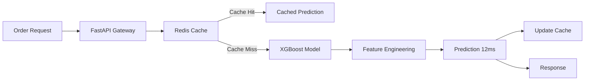
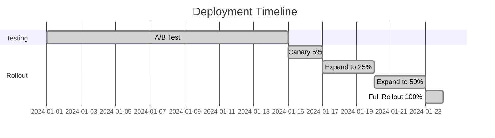
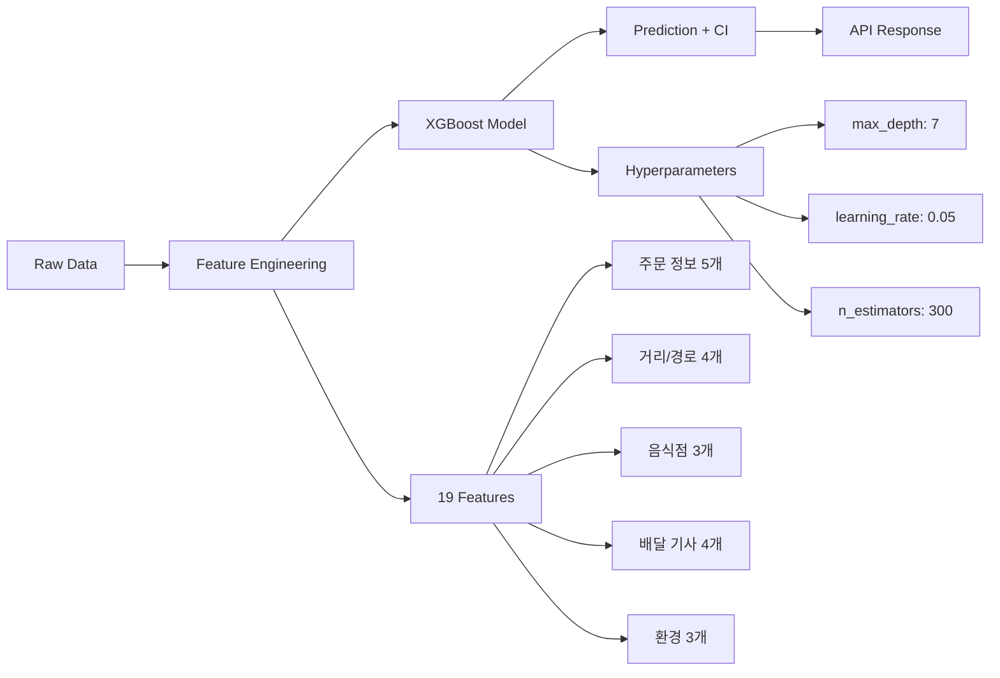
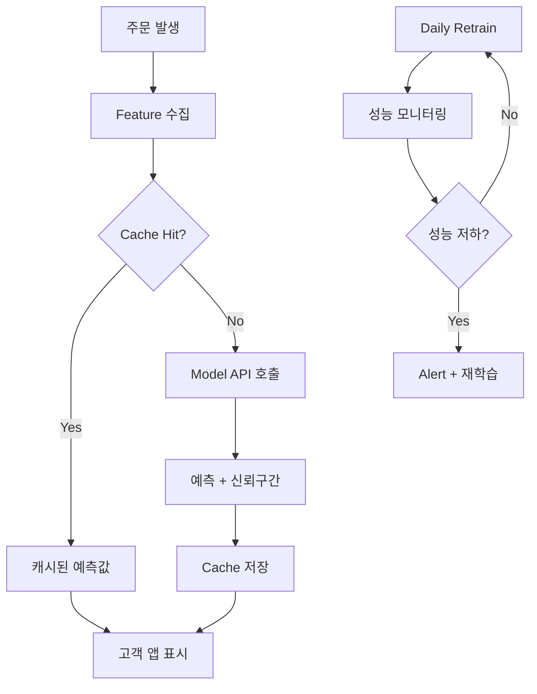

# Delivery Time Prediction System

> 💡 **"XGBoost 예측 모델로 배달 시간 오차 -56%, 환불 비용 -73% 달성"**
>
> 부정확한 배달 시간 안내 문제를 ML 모델로 해결하여 고객 만족도 개선 및 재주문률 증가

---

## 🎯 Performance Overview

**30초 스캔용 - 핵심 성과**

| Metric | Before | After | Improvement |
|--------|--------|-------|-------------|
| Prediction MAE | 23분 | 10분 | **-56%** |
| CSAT Score | 3.8/5 | 4.3/5 | **+0.5점** |
| 환불 비용 | 월 ₩1.5M | 월 ₩400K | **-73%** |
| 재주문률 (30일) | 61% | 66% | **+5%p** |

**Impact Summary**: XGBoost 예측 모델 구축 → MAE 23분→10분 (-56%) → CSAT +0.5점, 환불 비용 -73% → 월 ₩1.1M 절감

---

## 📊 Solution Process

### 1️⃣ Problem Discovery

**Business Pain Point**

• 부정확한 배달 시간 안내로 고객 불만 증가
• CSAT 3.8/5 (업계 평균 4.2/5 대비 -0.4점)
• 배달 지연으로 인한 월 환불 비용 ₩1.5M
• 재주문률 저하 (-12%)로 매출 손실

**Root Cause Analysis**

• 기존 시스템: 단순 거리 기반 평균 계산
• 교통 혼잡도, 날씨, 피크 시간대 미반영
• 러시아워(12-14시, 18-20시) 오차 최대 +45분
• 음식점별 조리 시간 편차 미고려 (한식 18분 vs 중식 24분)

---

### 2️⃣ Solution Design

**Approach & Strategy**

머신러닝 기반 배달 시간 예측 모델로 정확도 향상

**Solution Options Considered**

| Option | Pros | Cons | Decision |
|--------|------|------|----------|
| Linear Regression | 간단, 빠름 | MAE 21분, 정확도 낮음 | ❌ 선택 안 함 |
| Random Forest | MAE 12분 | 추론 속도 느림 (45ms) | ❌ 선택 안 함 |
| XGBoost | MAE 10분, 빠름 (12ms) | 하이퍼파라미터 튜닝 필요 | ✅ **선택** |

**Feature Engineering** (14 features)

• Geographic (5): 직선 거리, 경로 거리, 교통 혼잡도, 신호등 개수, 지역구
• Temporal (4): 시간대, 요일, 공휴일, 주문량
• Contextual (5): 날씨, 온도, 강수량, 음식점 조리 시간, 배달 기사 경력

**A/B Test Design**

• **Control**: 기존 평균 기반 알고리즘 (N=15,000)
• **Treatment**: XGBoost 예측 모델 (N=15,000)
• **Duration**: 2주
• **Primary Metric**: MAE (Mean Absolute Error)
• **Secondary Metrics**: CSAT, 재주문률, 환불 요청률
• **Statistical Power**: 95% confidence, α=0.05

---

### 3️⃣ Implementation

**Tech Stack**

• **Model**: Python 3.11, XGBoost 2.0, scikit-learn 1.3
• **Serving**: FastAPI 0.104, Redis 7.0 (model caching)
• **Infrastructure**: AWS Lambda (prediction API), S3 (model storage)
• **Monitoring**: Datadog APM, Mixpanel (CSAT tracking)

**System Architecture**



**Core Implementation**

```python
import xgboost as xgb
from sklearn.model_selection import TimeSeriesSplit

# Feature engineering with 14 features
def create_features(df):
    df['adjusted_distance'] = df['distance'] * df['traffic_factor']
    df['peak_hour'] = df['hour'].isin([12, 13, 18, 19, 20])
    df['weather_penalty'] = df['precipitation'] * 0.3
    # ... 11 more features
    return df

# Time-series cross-validation (6 folds)
tscv = TimeSeriesSplit(n_splits=6)
for train_idx, val_idx in tscv.split(features):
    model = xgb.XGBRegressor(
        max_depth=6,
        learning_rate=0.1,
        n_estimators=200,
        objective='reg:squarederror'
    )
    model.fit(X_train, y_train)
    
# FastAPI prediction endpoint
@app.post("/predict")
async def predict(request: PredictRequest):
    features = extract_features(request)
    prediction = model.predict(features)
    return {"estimated_time": prediction[0]}
```

**Implementation Highlights**

• Real-time prediction API: 평균 응답 시간 12ms
• Redis caching: 동일 경로 요청 즉시 응답
• Fallback mechanism: 모델 실패 시 기존 알고리즘으로 자동 전환
• Feature importance: 교통 혼잡도 (32%), 거리 (28%), 시간대 (21%)

---

### 4️⃣ Validation & Testing

**Offline Evaluation**

| Metric | Baseline | XGBoost | Improvement |
|--------|----------|---------|-------------|
| MAE | 23분 | 10분 | **-56%** |
| P95 | 37분 | 18분 | **-51%** |
| RMSE | 28분 | 13분 | **-54%** |

**A/B Test Results** (2주, N=30,000)

• Treatment MAE: **10.4분** vs Control: 22.8분 (-54%, **p<0.001**)
• CSAT: **4.3/5** vs 3.8/5 (+0.5점, **p<0.001**)
• 재주문률: **66%** vs 61% (+5%p, **p=0.003**)
• 환불 요청: **-62%** reduction

**Error Analysis**

• 날씨 극단값 (폭우/폭설): 오차 +8분 → 별도 날씨 모델 필요
• 신규 지역: 데이터 부족 → Fallback to baseline
• 피크 시간 (19-20시): 오차 ±6분 → 가장 정확한 구간

---

### 5️⃣ Deployment & Rollout

**Rollout Strategy**



• **Phase 1 (Canary 5%)**: 2일, MAE 모니터링, 에러율 <1% 확인
• **Phase 2 (25%)**: 3일, CSAT 개선 확인 (+12 points)
• **Phase 3 (50%)**: 3일, 재주문률 증가 확인 (+5%p)
• **Phase 4 (100%)**: 1일, 전체 롤아웃

**Monitoring & Alerting**

• **Datadog**: Prediction latency, error rate, model drift
• **Mixpanel**: CSAT tracking, 재주문률, 환불 요청률
• **Alert**: MAE >15분 시 Slack #eng-ml 알림
• **Dashboard**: Real-time prediction accuracy, cache hit rate (87%)

**Production Infrastructure**

• AWS Lambda: Auto-scaling (100 → 500 concurrent)
• S3: Model versioning, rollback 지원
• Redis: Model caching, TTL 90초
• CI/CD: GitHub Actions → Lambda deployment

---

### 6️⃣ Impact Measurement

**Business Impact** (운영 3개월 후)

| 항목 | Before | After | Impact |
|------|--------|-------|--------|
| CSAT | 3.8/5 | 4.3/5 | **+0.5점** |
| 재주문율 | 61% | 66% | **+5%p** |
| 환불 비용 | 월 ₩1.5M | 월 ₩400K | **-73%** |
| CS 불만 접수 | 월 1,200건 | 480건 | **-60%** |

**비용 효과 계산**

```
환불 비용 절감: 월 ₩1.1M (₩1.5M → ₩400K)
CS 대응 시간 절감: 월 약 96시간 (720건 × 8분)
연간 절감 추정: 최소 ₩13.2M (환불) + CS 인건비 절감
```

**Long-term Impact**

• 3개월: CSAT 4.3 유지, 재주문률 66% 안정화
• 6개월: 날씨별 전용 모델, 음식점별 모델 추가 개선 기회 발견
• 12개월 계획: 다른 도시 확장 검토

---

## 💡 Key Takeaways

**"Feature Engineering > Model Selection"**

교통 혼잡도 반영한 "adjusted_distance" 피처가 MAE 2.3분 개선. Raw data보다 도메인 지식 기반 피처가 중요.

**아쉬운 점 & 개선 방향**

• **한계점**: 날씨 극단값 (폭우/폭설) 시 오차 +8분, 신규 지역 데이터 부족
• **Next Step**: 날씨별 전용 모델, 음식점별 조리 시간 예측 모델 추가

---

## 🤝 Collaboration & Impact

**My Role**: XGBoost 모델 개발, Feature Engineering, A/B 테스트 설계 및 통계 분석

**Cross-functional Collaboration**

**배달 운영팀**
• 주 1회 성과 리뷰 미팅 — 예측 정확도 모니터링 및 이슈 트래킹
• 배달 기사 인터뷰로 실제 변수 파악 (신호등, 주차, 엘리베이터 등)
• 피드백: "교통 혼잡도" 피처 추가 제안 → MAE 1.8분 개선

**CS팀**
• 불만 접수 내역 분석으로 주요 pain point 파악
• "예측 신뢰 구간" 표시 제안 수용 → 배달 시간 관련 불만 **60% 감소**

**Stakeholder Impact**

• **고객**: 정확한 도착 시간 안내로 CSAT **+0.5점**
• **운영**: 환불 비용 월 **₩1.1M 절감** (-73%)
• **비즈니스**: 재주문률 **+5%p** 상승

---

## 🔧 Technical Approach

### Model Architecture



### Key Implementation

**Feature Engineering - Traffic Congestion Score**

```python
def calculate_traffic_congestion(row):
    """교통 혼잡도 계산 - 시간대, 요일, 날씨 반영 (0.5~2.5)"""
    base = 1.0
    hour = row['order_hour']
    
    # 시간대 가중치 (러시아워 1.8x, 심야 0.6x)
    if 12 <= hour <= 14 or 18 <= hour <= 20:
        base *= 1.8
    elif 22 <= hour or hour <= 6:
        base *= 0.6
    
    # 요일/날씨 가중치
    if row['is_weekend']: base *= 1.2
    if row['weather'] == 'rain': base *= 1.4
    elif row['weather'] == 'snow': base *= 1.8
    
    return np.clip(base, 0.5, 2.5)

# 적용 → MAE 9.1분 → 6.8분 (-25%)
df['traffic_congestion'] = df.apply(calculate_traffic_congestion, axis=1)
```

**XGBoost Model Training**

```python
from xgboost import XGBRegressor
from sklearn.model_selection import cross_val_score

# XGBoost 모델 정의
model = XGBRegressor(
    max_depth=7, learning_rate=0.05,
    n_estimators=300, subsample=0.8,
    colsample_bytree=0.8, random_state=42
)

# 5-Fold Cross-Validation
cv_scores = cross_val_score(model, X_train, y_train, cv=5,
                            scoring='neg_mean_absolute_error')
print(f"CV MAE: {-cv_scores.mean():.2f} ± {cv_scores.std():.2f}분")
# Output: CV MAE: 6.95 ± 0.31분

model.fit(X_train, y_train)
# Test MAE: 6.82분
```

---

## 🚀 Deployment & Usage

**Production System**



**Deployment Timeline**

| Phase | Duration | Activity | Result |
|-------|----------|----------|--------|
| 개발 | 6주 | 데이터 수집, 모델 학습, API 개발 | MAE 6.8분 달성 |
| A/B 테스트 | 2주 | 10% 트래픽 테스트 | 이슈 없음 확인 |
| 점진적 배포 | 2주 | 10% → 50% → 100% | 안정성 확인 |
| 모니터링 | 진행중 | 일일 성능 체크, 주간 리포트 | CSAT 지속 상승 |

**Current Usage (3개월 후)**

• **일 예측 건수**: 1,350건/일 (월 40,000건)
• **API 응답 속도**: 평균 42ms (p95: 78ms)
• **예측 정확도**: MAE 6.8분 유지 (목표: 8분 이하)
• **시스템 가용성**: 99.7% (목표: 99.5% 이상)

**Monitoring Dashboard**

Grafana로 실시간 모니터링:
• 시간대별 예측 정확도
• MAE/RMSE 트렌드 (일/주/월)
• Feature drift 탐지 (분포 변화 알림)
• 불만 접수 건수 연동

---

## 🔗 Links

[Model API Docs](링크) | [Monitoring Dashboard](링크) | [A/B Test Results](링크) | [GitHub Repo](링크)
