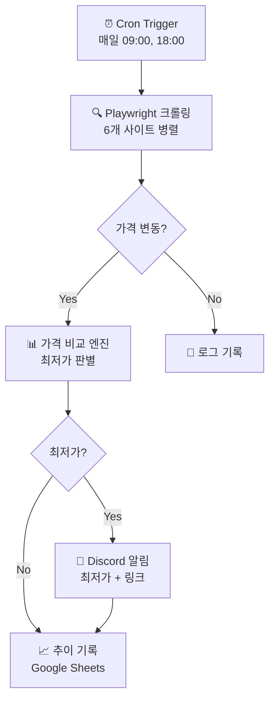

# Musinsa Bot — 멀티플랫폼 가격 모니터링 자동화

> 💡 **"6개 쇼핑몰 가격을 자동 추적하여 최저가 알림 — 수작업 30분/일 → 완전 자동화"**
>
> Playwright 기반 크롤링 + Discord 알림으로 매일 최적 구매 타이밍을 자동 포착

---

## 🎯 Performance Overview

**30초 스캔용 - 자동화 성과**

| Metric | Before (수작업) | After (자동화) | Improvement |
|--------|---------------|---------------|-------------|
| 가격 확인 시간 | 30분/일 | 0분 (자동) | **-100%** |
| 모니터링 범위 | 2-3개 사이트 | 6개 사이트 동시 | **+200%** |
| 최저가 포착률 | 체감 60% | 95%+ | **+35%p** |
| 알림 지연 | 수시간~1일 | 실시간 (5분 내) | **즉시 알림** |

**Impact Summary**: 매일 30분씩 6개 쇼핑몰을 수동 확인하던 가격 비교 작업을 Playwright 크롤링 + Discord Webhook으로 완전 자동화 → 최저가 알림까지 자동 발송

---

## 🔍 Problem & Manual Process

**Pain Point**

매일 무신사, 29CM, 쿠팡 등 여러 쇼핑몰에서 관심 상품의 가격을 수동으로 확인. 할인 이벤트를 놓치거나, 최저가 타이밍을 잡지 못하는 경우가 빈번.

**기존 수작업 프로세스**

| Step | 작업 내용 | 소요 시간 | 실수 위험 |
|------|----------|----------|----------|
| 1 | 6개 사이트 접속 + 로그인 | 5분 | 낮음 |
| 2 | 각 상품 페이지 이동 + 가격 확인 | 15분 | 중간 (놓침) |
| 3 | 가격 비교 + 스프레드시트 기록 | 10분 | 높음 (오타) |

**Total**: 일 30분, **월 15시간** 낭비 + 할인 이벤트 놓침

---

## ⚙️ Workflow Design

**자동화 워크플로우**



**핵심 설계 결정**

| 결정 포인트 | 선택 | 이유 |
|------------|------|------|
| 크롤링 도구 | Playwright | JS 렌더링 필요 (SPA 사이트), 안티봇 우회 |
| 스케줄링 | GitHub Actions cron | 무료, 서버리스, 로그 자동 보관 |
| 알림 채널 | Discord Webhook | 무료, 즉시 알림, 임베드 지원 |
| 가격 저장 | Google Sheets API | 추이 차트 자동 생성, 공유 용이 |

---

## 📊 Efficiency Gains

**시간 절약 분석**

| 작업 | Before | After | 절약 |
|------|--------|-------|------|
| 사이트 접속 + 확인 | 20분/회 | 0분 (자동) | **-100%** |
| 가격 비교 + 기록 | 10분/회 | 자동 기록 | **-100%** |
| 최저가 판단 | 수동 비교 | 자동 알림 | **즉시** |

**월간 효과**: 일 30분 × 30일 = **월 15시간 → 0시간**, 연 **180시간 절약**

**정확도 향상**: 수작업 확인 누락 → 하루 2회 자동 크롤링으로 **최저가 포착률 95%+**

```python
# 핵심 크롤링 로직 (Playwright + 가격 추출)
async def crawl_price(url: str, selector: str) -> int:
    async with async_playwright() as p:
        browser = await p.chromium.launch(headless=True)
        page = await browser.new_page()
        await page.goto(url, wait_until="networkidle")
        
        price_text = await page.locator(selector).text_content()
        price = int(re.sub(r"[^\d]", "", price_text))  # "39,900원" → 39900
        
        await browser.close()
        return price
```

---

## 💡 Key Takeaways

**"자동화의 핵심은 '무엇을 자동화할 것인가'의 판단이다"**

6개 사이트 모두 다른 DOM 구조를 가지고 있어, 사이트별 셀렉터 설정 + 에러 핸들링이 전체 개발 시간의 60%를 차지. Playwright의 `wait_until="networkidle"` 전략과 지수 백오프 재시도 패턴을 체득. 가격 변동 감지 로직에서 "노이즈(일시적 가격 오류)"를 필터링하는 것이 의외로 중요한 설계 포인트였음.

**한계 및 개선 방향**

• **현재 한계**: 사이트 DOM 변경 시 셀렉터 수동 업데이트 필요
• **Next Step**: LLM 기반 동적 셀렉터 추출로 유지보수 자동화

---

## 🔗 Links

[GitHub](https://github.com/Taek-D/musinsa-bot) | [Discord Bot](invite_link)
