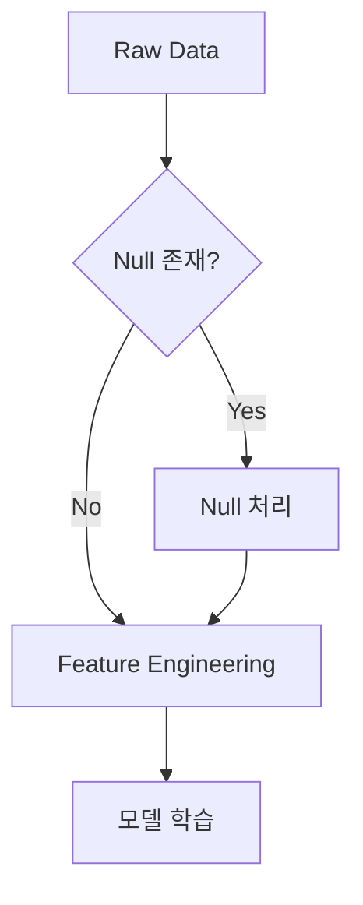
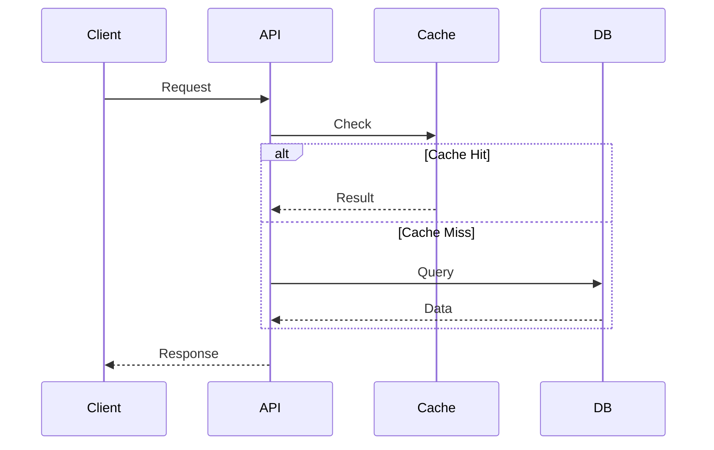
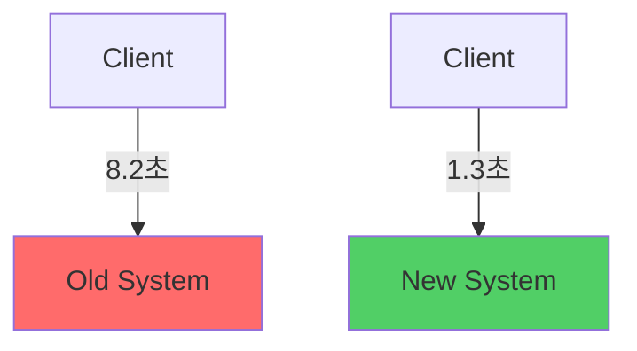
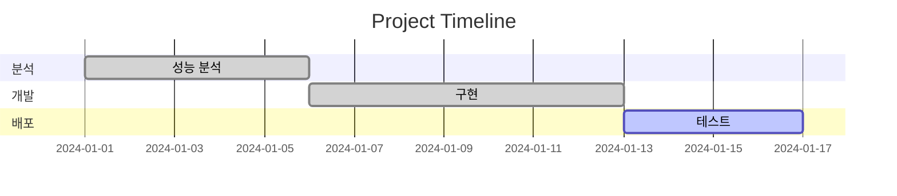

# Mermaid Diagram Guide

## Diagram Types & When to Use

| Type | When | Example Use |
|------|------|-------------|
| **Flowchart** | 프로세스, 의사결정 | 데이터 파이프라인, 분석 흐름 |
| **Sequence** | API/시스템 상호작용 | 캐싱 레이어, API 호출 흐름 |
| **Graph** | 아키텍처, 데이터 흐름 | Before/After 비교 |
| **Gantt** | 타임라인, 일정 | 프로젝트 일정, 학습 로드맵 |
| **State** | 상태 전환 | 주문 상태, 사용자 여정 |
| **ER** | 데이터 모델 | DB 스키마, 테이블 관계 |

## 프로젝트별 추천

| Type | 추천 다이어그램 |
|------|---------------|
| Type 1 | Graph (Before/After), Flowchart (파이프라인), Sequence (API) |
| Type 2 | Flowchart (분석 프로세스), Graph (데이터 소스), State (사용자 여정) |
| Type 4 | Flowchart (학습 프로세스), Graph (모델 구조), Gantt (학습 타임라인) |

## 핵심 문법

### Flowchart

방향: `TB`(위→아래), `LR`(왼→오른), 노드: `[]`사각, `{}`마름모(조건)

### Sequence Diagram

### Graph (Before/After)

### Gantt

## Best Practices

**✅ DO**:
- Before/After는 색상으로 구분 (빨강: 문제 `#ff6b6b`, 초록: 개선 `#51cf66`)
- 노드에 성과 수치 포함 (`-->|1.3초|`)
- 한 다이어그램 = 한 메시지
- 노드 15개 이하

**❌ DON'T**:
- 모든 노드에 색상 → 3가지만 (빨강/초록/파랑)
- 노드 30개+ → 여러 다이어그램으로 분리
- 약어만 사용 → 풀네임 사용 (USR → User)
