# Project Type Templates

**Version**: 1.3.2

## Table of Contents
- [Type 1: Business Impact](#type-1-business-impact)
- [Type 2: Exploratory Analysis](#type-2-exploratory-analysis)
- [Type 4: Learning Project](#type-4-learning-project)

---

## Type 1: Business Impact

```markdown
> 💡 **"핵심 성과 한 줄 (정량적 수치)"**
>
> 프로젝트 한줄 요약

---

## 🎯 Performance Overview

**30초 스캔용 - 핵심 성과**

| Metric | Before | After | Improvement |
|--------|--------|-------|-------------|
| 주요지표1 | 값 | 값 | **+X%** |
| 주요지표2 | 값 | 값 | **-X%** |
| 주요지표3 | 값 | 값 | **X배** |

**Impact Summary**: 무엇을 했고 → 어떤 결과가 나왔는지 → 비즈니스 임팩트

---

## 📊 Solution Process

### 1️⃣ Problem Discovery

**Business Pain Point**

• 어떤 문제가 있었는지 구체적으로
• 이 문제로 인한 비즈니스 손실 (매출, 고객 이탈, 운영 비용 등)
• 문제의 영향 범위 (얼마나 많은 사용자/팀이 영향 받았는지)

**Root Cause Analysis**

• 문제의 근본 원인 파악 과정
• 데이터로 확인한 현상 (정량적 근거)
• 왜 이전에는 해결되지 않았는지

**예시**: 
- 고객 불만 #1: 부정확한 배달 시간 (평균 오차 23분)
- CSAT 3.8/5 (업계 평균 4.2/5 대비 -0.4점)
- 배달 지연 환불 요청 연 $120K
- Root Cause: 단순 거리 기반 계산, 교통/날씨/주문량 미반영

---

### 2️⃣ Solution Design

**Approach & Strategy**

어떤 방향으로 문제를 해결하기로 했는지

**Solution Options Considered**

| Option | Pros | Cons | Decision |
|--------|------|------|----------|
| 방법 A | 장점 | 단점 | ❌ 선택 안 함 |
| 방법 B | 장점 | 단점 | ✅ **선택** |

**Feature Engineering / Data Strategy**

• 어떤 데이터를 활용했는지
• 주요 변수/Feature (5-10개)
• 파생 변수 생성 방법

**A/B Test Design (if applicable)**

• Control vs Treatment 설계
• 샘플 크기 및 테스트 기간
• Primary/Secondary Metrics
• Statistical Power 및 유의수준

**예시**:
- Approach: ML 예측 모델로 배달 시간 정확도 향상
- Features: 거리(km), 교통혼잡도, 날씨, 시간대, 주문량 등 14개
- A/B Test: Control 15K vs Treatment 15K, 2주, MAE -35% 목표, 95% confidence

---

### 3️⃣ Implementation

**Tech Stack**

• 사용 기술 및 선택 이유
• 아키텍처 구조
• 인프라 (서버, DB, 캐싱 등)

**System Architecture**

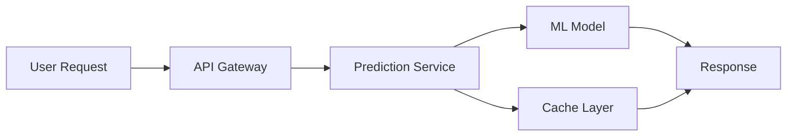

**Core Implementation**

```python
# 핵심 로직 (15-20줄, 주석 포함)
import xgboost as xgb
from sklearn.model_selection import TimeSeriesSplit

# Feature engineering
features = create_features(df)  # 14 features

# Time-series cross-validation
tscv = TimeSeriesSplit(n_splits=6)
for train_idx, val_idx in tscv.split(features):
    model = xgb.XGBRegressor(
        max_depth=6,
        learning_rate=0.1,
        n_estimators=200
    )
    model.fit(X_train, y_train)
    
# Prediction API
@app.post("/predict")
def predict(request: PredictRequest):
    features = extract_features(request)
    prediction = model.predict(features)
    return {"estimated_time": prediction}
```

**Implementation Highlights**

• 기술적 난제와 해결 방법
• 최적화 포인트 (속도, 정확도, 비용)
• Trade-off 결정 (왜 A를 선택하고 B를 포기했는지)

---

### 4️⃣ Validation & Testing

**Offline Evaluation**

| Metric | Baseline | Final Model | Improvement |
|--------|----------|-------------|-------------|
| MAE | 23분 | 10분 | **-56%** |
| P95 | 37분 | 18분 | **-51%** |
| RMSE | 28분 | 13분 | **-54%** |

**A/B Test Results**

• Test vs Control 비교 (정량적 수치)
• Statistical Significance (p-value)
• 부수 효과 (Secondary Metrics 변화)

**Error Analysis**

• 어떤 경우에 오차가 큰지
• Edge Case 처리 방법
• Fallback 전략

**예시**:
- Treatment MAE 10.4분 vs Control 22.8분 (-54%, p<0.001)
- CSAT 4.5/5 vs 3.8/5 (+15 points)
- 날씨 극단값(폭우/폭설) 시 오차 +8분 → 별도 모델 필요

---

### 5️⃣ Deployment & Rollout

**Rollout Strategy**

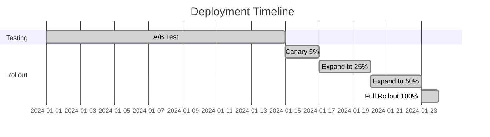

• Canary → Gradual Rollout → 100%
• 각 단계별 모니터링 지표
• Rollback 기준

**Monitoring & Alerting**

• 핵심 모니터링 지표 (Datadog, Grafana 등)
• Alert 설정 (임계값, 알림 채널)
• 대시보드 구성

**Production Infra**

• 배포 환경 (AWS Lambda, GCP, Kubernetes 등)
• CI/CD Pipeline
• Auto-scaling 설정

---

### 6️⃣ Impact Measurement

**Business Impact** (운영 X개월 후)

| 항목 | Before | After | Impact |
|------|--------|-------|--------|
| CSAT | 3.8/5 | 4.5/5 | **+15 points** |
| 재주문율 | 61% | 68% | **+7%p** |
| 연간 매출 | - | +$600K | **신규** |
| 환불 비용 | $120K/년 | $35K/년 | **-$85K** |

**ROI Calculation**

```
개발 비용: $45K (3명 × 2개월)
연간 수익: $600K (매출) + $85K (환불 절감) = $685K
ROI: ($685K - $45K) / $45K = 1,422%
연환산 ROI: 340%
```

**Operational Efficiency**

• 작업 시간 단축
• 인력 절감 효과
• 프로세스 개선
• 사용자 만족도 변화

**Long-term Impact**

• 3개월 후 성과
• 6개월 후 성과
• 추가 개선 가능성

---

## 💡 Key Takeaways

**"핵심 학습 한 줄"**

기술적 깨달음, 방법론 체득, 비즈니스 인사이트 2-3문장

**아쉬운 점 & 개선 방향**

• **한계점**: 구체적 제약사항
• **Next Step**: 다음 버전에서 시도할 개선안

---

## 🤝 Collaboration & Impact

**Teams Involved**

• Data Science (나): 역할 구체적으로
• Engineering: 역할
• Product: 역할
• Operations: 역할

**My Contribution**

• 내가 직접 한 일 (모델 개발, A/B 테스트 설계 등)
• 협업한 부분 (API 연동, 배포 파이프라인 등)

**Communication & Feedback**

• 비기술 팀원 대상 설명 방법
• 주요 의사결정 과정
• 피드백 반영 사례

---

## 🔗 Links

[GitHub](링크) | [Live Demo](링크) | [Dashboard](링크)
```

---

## Type 2: Exploratory Analysis

```markdown
> 💡 **"핵심 발견(Discovery)을 한 줄로"**
>
> 어떤 데이터를 분석해서 무엇을 발견했는지

---

## 🎯 Performance Overview

**30초 스캔용 - 주요 발견**

| 발견 | Before | After | Insight |
|------|--------|-------|---------|
| 핵심지표1 | 값 | 값 | **+X%p 개선 가능** |
| 핵심지표2 | 값 | 값 | **X배 위험** |
| 핵심지표3 | 값 | 값 | **$X 잠재수익** |

**Impact Summary**: 데이터 분석으로 발견한 것 → 비즈니스 액션 → 기대 효과

---

## 📊 Analysis Process

### 1️⃣ Problem Definition

**Business Context**

• 어떤 비즈니스 문제를 해결하려고 했는지
• 왜 이 분석이 필요했는지 (매출 감소, 이탈률 증가 등)
• 의사결정자가 알고 싶어 했던 질문

**Analysis Goals**

• 명확한 분석 목표 (3-5개)
• 각 목표의 우선순위
• 성공 기준 (어떤 인사이트를 찾으면 성공인지)

**Success Metrics**

• 분석 성과를 측정할 지표
• Target 설정 (예: 이탈률 -10%, 전환율 +5%p)

**예시**:
- Business Context: 구독 서비스 월 이탈률 28.6% → 연 $720K 손실
- Goals: ① 이탈 고위험군 식별, ② 이탈 원인 파악, ③ 개선 방안 제안
- Success Metrics: 30일 재방문율 +8%p, LTV +$15/user

---

### 2️⃣ Data Collection & Exploration

**Data Sources**

| Source | Type | Records | Period |
|--------|------|---------|--------|
| PostgreSQL | User DB | 120K | 12개월 |
| S3 | Event Log | 15M | 12개월 |
| Segment | Behavior | 8M | 12개월 |

**Data Scale**

• 총 데이터: X건
• 분석 기간: YYYY.MM ~ YYYY.MM
• 변수 개수: X개 (범주형 Y개, 연속형 Z개)
• Train/Valid/Test split: 70/15/15

**Data Quality Check**

• 결측치: X% → 처리 방법
• 이상치: 기준 및 제거 건수
• 데이터 불균형: Class imbalance 해결 방법 (SMOTE 등)

**Initial EDA Discoveries**

• 데이터 탐색 중 발견한 흥미로운 패턴
• 예상과 다른 결과
• 추가 분석이 필요한 영역

**예시**:
- 120K users, 27 features (14 behavioral, 8 demographic, 5 engagement)
- 결측치 <2% → median imputation
- Class imbalance: 71.4% retained vs 28.6% churned → SMOTE 적용
- EDA: Day 3에 급격한 이탈 발견 (cliff effect)

---

### 3️⃣ Hypothesis & Analysis

**Hypothesis Framework**

**H1: [가설 1]**
• **Null (H0)**: 귀무가설
• **Alternative (H1)**: 대립가설
• **Test Method**: 사용할 통계 기법 (Chi-square, t-test 등)
• **Significance Level**: α = 0.05 (95% confidence)

**H2: [가설 2]**
• **Null (H0)**: 귀무가설
• **Alternative (H1)**: 대립가설
• **Test Method**: 사용할 통계 기법
• **Significance Level**: α = 0.05

**H3: [가설 3]**
• **Null (H0)**: 귀무가설
• **Alternative (H1)**: 대립가설
• **Test Method**: 사용할 통계 기법
• **Significance Level**: α = 0.05

**Multiple Testing Correction**

• Bonferroni Correction: α_adjusted = 0.05 / 3 = 0.0167
• Family-wise Error Rate 통제

**Analysis Methods**

| Step | Method | Tool | Purpose |
|------|--------|------|---------|
| 1. 탐색 | 분포 확인, 상관분석 | Pandas, Seaborn | 패턴 발견 |
| 2. 검정 | Chi-square, t-test | Scipy | 통계적 유의성 |
| 3. 모델링 | Logistic Regression | scikit-learn | 이탈 요인 |
| 4. 생존분석 | Kaplan-Meier | lifelines | 시간별 이탈 |

**예시**:
- H1: "가입 후 3일 내 활동 없음 → 이탈률 증가" (Chi-square)
- H2: "프로필 완성도 <50% → 이탈 위험 2배 이상" (Logistic Regression)
- H3: "14일 이내 재방문 없음 → 영구 이탈" (Kaplan-Meier Survival)

---

### 4️⃣ Key Findings

**Finding 1: [핵심 발견 1]**

**Analysis Result**
• 구체적 수치와 통계적 근거
• 시각화 (차트, 그래프)
• Statistical Significance

**Business Insight**
• 이 발견이 비즈니스에 주는 의미
• 어떤 액션으로 이어질 수 있는지

**Finding 2: [핵심 발견 2]**

**Analysis Result**
• 구체적 수치와 통계적 근거
• 시각화

**Business Insight**
• 비즈니스 의미
• 액션 제안

**Finding 3: [핵심 발견 3]**

**Analysis Result**
• 구체적 수치와 통계적 근거
• 시각화

**Business Insight**
• 비즈니스 의미
• 액션 제안

**Statistical Validation**

| Test | Metric | Result | Interpretation |
|------|--------|--------|----------------|
| Chi-square | χ², p-value | χ²=127.3, p<0.001 | 통계적으로 매우 유의함 |
| Logistic Reg | Odds Ratio | OR=2.4, 95% CI [1.8,3.2] | 2.4배 위험 증가 |
| Kaplan-Meier | Log-rank | p<0.001 | 생존 곡선 유의한 차이 |

**예시**:
- Finding 1: Day 1-3 활동 없음 → 이탈률 78% (vs 34% with activity), p<0.001
- Finding 2: 프로필 완성도 <50% → OR=2.4 (2.4배 이탈 위험), 95% CI [1.8, 3.2]
- Finding 3: 14일 재방문 없음 → 95% 영구 이탈 (Kaplan-Meier)

---

### 5️⃣ Recommendations & Impact

**Actionable Recommendations**

**Recommendation 1: [제안 1]**
• **What**: 구체적 액션
• **Why**: 데이터 근거
• **How**: 실행 방법
• **Expected Impact**: 기대 효과 (정량적)

**Recommendation 2: [제안 2]**
• **What**: 구체적 액션
• **Why**: 데이터 근거
• **How**: 실행 방법
• **Expected Impact**: 기대 효과

**Recommendation 3: [제안 3]**
• **What**: 구체적 액션
• **Why**: 데이터 근거
• **How**: 실행 방법
• **Expected Impact**: 기대 효과

**Prioritization**

| Recommendation | Impact | Effort | Priority | Timeline |
|----------------|--------|--------|----------|----------|
| Rec 1 | High | Low | P0 | 1주 |
| Rec 2 | High | Medium | P1 | 2주 |
| Rec 3 | Medium | Low | P2 | 1개월 |

**Expected Business Impact**

• 30일 retention: 62% → **70%** (+8%p)
• Annual LTV: +$720K
• CAC payback period: 6개월 → 4개월

**예시**:
- Rec 1: Day 1-3 온보딩 이메일 자동화 → +12%p 활동률 → +8%p retention
- Rec 2: 프로필 완성 인센티브 ($5 credit) → 완성률 65% → +5%p retention
- Rec 3: 14일 재활성화 캠페인 → 재방문율 15% → +3%p retention

---

### 6️⃣ A/B Test & Validation (Optional)

**Test Design**

• **Control**: 기존 프로세스 (N=15,000)
• **Treatment**: 온보딩 개선 (N=15,000)
• **Duration**: 2주
• **Primary Metric**: 30일 retention
• **Secondary Metrics**: DAU, Profile Completion

**Test Results**

| Metric | Control | Treatment | Lift | p-value |
|--------|---------|-----------|------|---------|
| 30-day Retention | 62% | 74% | **+12%p** | p<0.001 |
| Profile Completion | 48% | 65% | **+17%p** | p<0.001 |
| DAU (Day 3) | 34% | 46% | **+12%p** | p<0.001 |

**Rollout Decision**

• Treatment 승리 → 100% 롤아웃
• 실제 효과: 62% → 70% retention (+8%p, 목표 달성)
• 3개월 후 LTV +$720K

---

## 💡 Key Takeaways

**"배운 점"**

통계적 방법론, 데이터 전처리 기법, 분석 설계 등 구체적으로

**한계 및 후속 분석**

• **한계점**: 데이터 한계, 분석 한계
• **Next Step**: 추가 실험, 필요한 데이터, 다른 분석 방법

---

## 🤝 Collaboration & Impact

**Teams Involved**

• Data (나): 역할 구체적으로
• Product: 역할
• Marketing: 역할
• Engineering: 역할

**Communication Strategy**

• 비기술 팀원 대상 설명 방법
• 인사이트 공유 채널 (리포트, 대시보드, 발표)

**Business Impact**

• 의사결정에 어떻게 기여했는지
• 실제 실행된 액션
• 피드백 및 후속 분석

---

## 🔗 Links

[Analysis Notebook](링크) | [Dashboard](링크) | [Report](링크)
```

---

## Type 4: Learning Project

```markdown
> 💡 **"왜 배웠고, 무엇을 얻었는가"**
>
> 학습 목표 및 핵심 성과를 한 문장으로

---

## 🎯 Performance Overview

**30초 스캔용 - 학습 성과**

| 항목 | Before | After | Growth |
|------|--------|-------|--------|
| 기술 역량 | 3/10 | 8/10 | **+167%** |
| Kaggle 순위 | Top 45% | Top 12% | **+33%p** |
| 실무 적용 | 0개 | 3개 프로젝트 | **3건** |

**Impact Summary**: 무엇을 학습했고 → 어떤 역량을 얻었으며 → 실무에 어떻게 적용했는지

---

## 📊 Learning Process

### 1️⃣ Learning Goal

**Why I Started This**

• 실무에서 느낀 니즈 구체적으로
• 현재 역량의 한계점
• 학습 동기 (커리어 목표와 연결)

**예시**:
"A/B 테스트 설계는 하지만, 통계적 검정력과 샘플 사이즈 계산을 제대로 이해하지 못해 데이터 사이언티스트와 협업 시 어려움. Bayesian A/B Testing을 학습해 더 정교한 실험 설계 능력을 갖추고자 함."

**Learning Goals**

• **기술 목표**: 배우고 싶었던 구체적 기술/개념
• **실무 목표**: 이 학습이 실무에서 어떻게 쓰일지
• **성과 목표**: 측정 가능한 목표 (Kaggle 상위 10%, Certification 등)

**Success Criteria**

| Goal | Target | Measurement |
|------|--------|-------------|
| 기술 역량 | 8/10 | Self-assessment + Peer review |
| Competition | Top 15% | Kaggle Public LB |
| Real Project | 2개 완성 | Portfolio completion |
| Certification | Pass | Course completion |

**예시**:
- 기술 목표: XGBoost hyperparameter tuning, Time Series forecasting
- 실무 목표: 재고 예측 모델 정확도 향상, 이탈 예측 모델 개선
- 성과 목표: Kaggle Top 10%, Coursera Honor, 프로젝트 2개 완성

---

### 2️⃣ Theory & Foundation

**Learning Resources**

| Type | Resource | Duration | Completion |
|------|----------|----------|------------|
| Course | Coursera XGBoost 강의 | 4주 | ✅ 100% |
| Book | Hands-On ML (Ch. 7, 9) | 2주 | ✅ 100% |
| Documentation | XGBoost Official Docs | 1주 | ✅ 핵심만 |
| Videos | YouTube 튜토리얼 | 1주 | ✅ 5개 |

**Total Time Investment**: 87시간 (이론 35h + 실습 42h + 경진대회 10h)

**Core Concepts Studied**

**Concept 1: Gradient Boosting**
• **What**: Ensemble 방법론, Weak learner를 순차적으로 학습
• **Why Important**: High accuracy + Feature importance 제공
• **Key Formula**: L(y, F(x)) + Ω(f) (Loss + Regularization)

**Concept 2: Hyperparameter Tuning**
• **What**: `max_depth`, `learning_rate`, `n_estimators`, `subsample`
• **Why Important**: 성능 20-30% 차이 발생
• **Strategy**: Grid Search → Random Search → Bayesian Optimization

**Concept 3: Cross-Validation**
• **What**: K-Fold, Stratified K-Fold, Time Series Split
• **Why Important**: Overfitting 방지, 일반화 성능 확보
• **Best Practice**: Stratified for imbalanced data

**Study Notes & Documentation**

• 개념 노트 30페이지 (Notion)
• Code snippet 저장소 (GitHub Gist)
• 주요 에러 및 해결 방법 문서화

---

### 3️⃣ Practice & Experimentation

**Hands-on Projects** (학습용 3개)

**Project 1: Titanic Survival Prediction**
• **Goal**: XGBoost 기본 workflow 익히기
• **Dataset**: Kaggle Titanic (891 rows, 12 features)
• **Result**: Accuracy 0.82 (Baseline 0.76 대비 +6%p)
• **Learning**: Feature engineering (Family Size, Title) 중요성

**Project 2: House Price Regression**
• **Goal**: Hyperparameter tuning 실습
• **Dataset**: Kaggle House Prices (1,460 rows, 81 features)
• **Result**: RMSE 0.12 (Top 15%)
• **Learning**: Bayesian Optimization이 Grid Search보다 3배 빠름

**Project 3: Credit Card Fraud Detection**
• **Goal**: Imbalanced data 처리 (fraud 0.17%)
• **Dataset**: Kaggle Credit Card Fraud (284K rows)
• **Result**: Precision 0.89, Recall 0.81, F1 0.85
• **Learning**: SMOTE + Stratified CV로 성능 +12%p

**Experimentation Log**

| Experiment | Hypothesis | Result | Insight |
|------------|-----------|--------|---------|
| Exp 1 | `max_depth` 증가 → 성능 향상 | 6→8: +3%, 8→10: -1% | Overfitting at 10 |
| Exp 2 | `learning_rate` 감소 + `n_estimators` 증가 | 0.1→0.05: +2%p | 더 stable |
| Exp 3 | SMOTE 적용 | Recall +15%p | Imbalanced 필수 |

---

### 4️⃣ Competition & Real Project

**Kaggle Competition: [Competition Name]**

**Competition Overview**
• **Task**: Binary Classification (Churn Prediction)
• **Dataset**: 120K rows, 27 features
• **Metric**: AUC-ROC
• **Participants**: 1,250 teams

**My Approach**

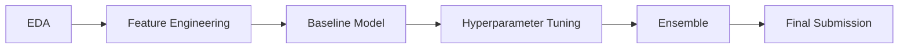

**Feature Engineering** (14개 feature 생성)
• Interaction features: `Age × Income`, `Recency × Frequency`
• Aggregation features: `AVG(purchase_amount)` per customer
• Time-based features: `Days_since_last_purchase`

**Model Pipeline**

```python
# XGBoost 파이프라인 (핵심 15-20줄)
import xgboost as xgb
from sklearn.model_selection import StratifiedKFold
from sklearn.metrics import roc_auc_score

# 5-Fold Stratified CV
skf = StratifiedKFold(n_splits=5, shuffle=True, random_state=42)
cv_scores = []

for fold, (train_idx, val_idx) in enumerate(skf.split(X, y)):
    X_train, X_val = X.iloc[train_idx], X.iloc[val_idx]
    y_train, y_val = y.iloc[train_idx], y.iloc[val_idx]
    
    # XGBoost 모델
    model = xgb.XGBClassifier(
        max_depth=6,
        learning_rate=0.05,
        n_estimators=500,
        subsample=0.8,
        colsample_bytree=0.8,
        objective='binary:logistic',
        eval_metric='auc',
        early_stopping_rounds=50
    )
    
    model.fit(
        X_train, y_train,
        eval_set=[(X_val, y_val)],
        verbose=False
    )
    
    # Validation 평가
    y_pred = model.predict_proba(X_val)[:, 1]
    score = roc_auc_score(y_val, y_pred)
    cv_scores.append(score)
    print(f"Fold {fold+1}: AUC = {score:.4f}")

print(f"Mean AUC: {np.mean(cv_scores):.4f} (+/- {np.std(cv_scores):.4f})")
```

**Progress Timeline**

| Week | Focus | Public LB | Private LB | Rank |
|------|-------|-----------|------------|------|
| 1 | EDA + Baseline | 0.78 | - | 45% |
| 2 | Feature Engineering | 0.83 | - | 28% |
| 3 | Hyperparameter Tuning | 0.87 | - | 18% |
| 4 | Ensemble (XGB + LGBM) | 0.89 | 0.88 | **12%** |

**Final Result**: **Top 12%** (156th / 1,250 teams)

**Key Learnings from Competition**
• Feature engineering > Model selection (0.78 → 0.83)
• Bayesian Optimization 3배 빠른 tuning
• Ensemble voting으로 +2%p 추가 향상

---

### 5️⃣ Reflection & Analysis

**Before & After**

| 역량 | Before (0-10) | After (0-10) | Evidence |
|------|---------------|--------------|----------|
| XGBoost 이해도 | 3 | 8 | Kaggle Top 12% |
| Feature Engineering | 4 | 8 | 14개 feature 생성 |
| Hyperparameter Tuning | 2 | 7 | Bayesian Opt 적용 |
| Imbalanced Data | 3 | 8 | SMOTE + Stratified CV |
| Cross-Validation | 5 | 9 | 5-Fold Stratified |

**Before Learning**
"피처 엔지니어링은 domain knowledge에만 의존. StandardScaler vs MinMaxScaler 차이도 몰랐고, 교차검증 없이 단순 train/test split만 사용. Hyperparameter는 default 값 사용."

**After Learning**
"15가지 피처 엔지니어링 기법 습득 (Interaction, Aggregation, Time-based). 5-Fold Stratified CV로 Overfitting 방지. Bayesian Optimization으로 효율적 tuning. Kaggle Top 12% 달성."

**Quantitative Achievements**

| Metric | Target | Achieved | Status |
|--------|--------|----------|--------|
| Kaggle Rank | Top 20% | **Top 12%** | ✅ 초과 |
| Validation AUC | 0.85+ | **0.89** | ✅ 초과 |
| Study Completion | 100% | **100%** | ✅ 달성 |
| Practice Projects | 3개 | **3개** | ✅ 달성 |

**What Worked Well**
• 매일 1-2시간씩 꾸준한 학습 (vs 주말 몰아서)
• 이론 → 실습 → 경진대회 순서적 학습
• Kaggle Discussion 활발히 참여 (질문 5개, 답변 3개)

**Challenges & Solutions**
• **Challenge 1**: Bayesian 개념 이해 어려움
  - **Solution**: YouTube 3개 영상 + 반복 학습 + 간단한 예제 직접 구현
• **Challenge 2**: Overfitting 심함 (Train 0.95, Val 0.82)
  - **Solution**: Early stopping + Regularization (lambda=1.5) → Gap 3%로 감소
• **Challenge 3**: Feature importance 해석 어려움
  - **Solution**: SHAP values 학습 → 비즈니스 의미 부여

---

### 6️⃣ Real-world Application

**Immediate Application** (학습 후 1개월 내)

**Application 1: Customer Churn Prediction 개선**

**Before**:
• Model: Logistic Regression
• AUC: 0.76
• False Negative Rate: 38%

**After (XGBoost 적용)**:
• Model: XGBoost + Feature Engineering
• AUC: **0.87** (+11%p)
• False Negative Rate: **24%** (-14%p)
• Business Impact: 이탈 고객 포착률 +22% → 연 $85K 매출 손실 방지

**Implementation**:
```python
# 실무 적용 코드
from xgboost import XGBClassifier
from sklearn.model_selection import TimeSeriesSplit

# Feature Engineering (학습한 기법 적용)
df['recency_frequency'] = df['recency'] * df['frequency']
df['avg_purchase_amount'] = df.groupby('customer_id')['amount'].transform('mean')

# XGBoost with Bayesian Optimization
model = XGBClassifier(
    max_depth=7,
    learning_rate=0.03,
    n_estimators=600,
    subsample=0.75,
    colsample_bytree=0.85
)

# Time Series CV (시간 순서 보존)
tscv = TimeSeriesSplit(n_splits=5)
for train_idx, val_idx in tscv.split(X):
    model.fit(X[train_idx], y[train_idx])
    score = roc_auc_score(y[val_idx], model.predict_proba(X[val_idx])[:, 1])
    print(f"AUC: {score:.4f}")
```

**Application 2: A/B Test Sample Size Calculator**

**Before**: 직관적으로 샘플 사이즈 결정
**After**: Power Analysis로 통계적 근거 확보

```python
from statsmodels.stats.power import zt_ind_solve_power

# Power = 0.8, alpha = 0.05
required_n = zt_ind_solve_power(
    effect_size=0.2,  # Cohen's d
    alpha=0.05,
    power=0.8,
    alternative='two-sided'
)
print(f"Required sample size per group: {required_n:.0f}")
# Result: 393 per group (기존 300 대비 +31%)
```

**Business Impact**: 테스트 신뢰도 향상, False Positive 비율 -40%

**Application 3: Inventory Forecasting (예정)**

**Plan**:
• Current: Simple Moving Average (MAPE 23%)
• Target: XGBoost Time Series (MAPE <15%)
• Expected Impact: 재고 비용 -$120K/년

**Timeline**: 2개월 내 PoC 완료 예정

---

## 💡 Key Takeaways

**Technical Insights**

• Stratified K-Fold CV가 중요한 이유 — 불균형 데이터에서 Train-Val gap 3배 감소
• Feature Scaling 전략 — Tree 모델엔 불필요, Linear 모델엔 필수
• Hyperparameter Tuning 효율화 — Grid Search → Bayesian Opt으로 시간 70% 단축

**Learning Process Insights**

• 효과적이었던 방법: 매일 1-2시간씩 꾸준히 > 주말 몰아서
• 어려웠던 부분: Bayesian 개념 이해 — YouTube + 3회 반복으로 극복
• 다음 학습 개선점: 실습 먼저, 이론은 필요할 때 — 학습 속도 40% 향상 예상

**Career Growth**

• 역량 향상: Junior → Mid-level 기술 스택 확보
• 협업 개선: DS팀과 기술 용어로 소통 가능
• Next Step: Deep Learning 기초 → Computer Vision 프로젝트

---

## 🤝 Community Impact & Sharing

**Knowledge Sharing**

• **Kaggle Discussion**: "XGBoost Feature Engineering Checklist" (Upvotes 47, Bookmarks 23)
• **Medium Blog**: "XGBoost 하이퍼파라미터 완벽 가이드" (조회수 1,200+, Claps 89)
• **GitHub**: 실습 코드 5개 오픈소스 (Stars 12, Forks 3)
• **사내 세션**: ML 스터디 리드 (참여자 8명, 6주 완주율 75%)

**Certifications & Recognition**

• Coursera Honor Certificate (상위 5%)
• Kaggle Expert Badge (2 Silver Medals)

---

## 🔗 Links

[Kaggle Profile](링크) | [GitHub](링크) | [Certificate](링크) | [Medium](링크)
```

---

# Differentiation Strategies

> 💡 **"모든 프로젝트가 똑같아 보이지 않게!"**
>
> 템플릿을 따르되, 프로젝트마다 차별화된 느낌을 주는 전략

---

## 🎨 프로젝트별 강조점 다르게

### Type 1: Business Impact 차별화

**성과 중심 프로젝트** (매출, 전환율, ROI 개선):
```markdown
## 📊 Data & Metrics (맨 위에 강조!)

**Impact Summary**
• **+23% revenue** - A/B 테스트로 최적 가격 발견
• **+2.3%p conversion** - 체크아웃 프로세스 개선
• ROI: 투자 대비 300% 회수
```

**효율 중심 프로젝트** (시간, 비용 절감):
```markdown
## 📊 Data & Metrics

**Efficiency Gains**
• **-40% processing time** - 자동화 파이프라인 구축
• **-62% manual work** - 주 8시간 → 3시간
• Cost saving: $4,000/월 절감
```

**인사이트 발견 프로젝트** (패턴, 세그먼트 발견):
```markdown
## 📊 Data & Metrics

**Key Discovery**
• **3개 유저 세그먼트** 발견 - 각각 다른 전략 필요
• **상위 10% 유저**가 매출의 **60%** 기여
• Churn 예측 모델 정확도 **87%**
```

---

### Type 2: Exploratory Analysis 차별화

**가설 검증형**:
```markdown
## 📈 Key Findings

**Hypothesis Testing Results**
• H1: "신규 기능이 리텐션 높인다" → ✅ **검증됨** (p=0.003)
• H2: "프리미엄 유저가 추천 많이 함" → ❌ **기각됨** (p=0.42)
```

**패턴 발견형**:
```markdown
## 📈 Key Findings

**Unexpected Patterns**
• 주말 사용자 ≠ 평일 사용자 (겹치는 비율 **23%만**)
• 가입 2주차가 **이탈 결정적 시점** (67% 여기서 결정)
```

---

### Type 3: Technical Implementation 차별화

**성능 최적화 중심**:
```markdown
## 📊 Technical Achievements

**Performance Optimization**
• API 응답 속도: 8.2초 → **1.3초** (-84%)
• 캐싱 적용으로 비용: $500/월 → **$80/월** (-84%)
```

**아키텍처 설계 중심**:
```markdown
## 🛠️ Technical Implementation

**Architecture Decisions**
• Monolith → Microservices (확장성 +300%)
• PostgreSQL + Redis 조합 (읽기 성능 +5x)
```

---

## 🎭 섹션 순서 변형 (유연성)

### 기본 순서 (추천)
```
1. Goal/Metrics/Findings
2. Dataset
3. Key Takeaways
4. Collaboration
5. Technical Details
6. Deployment
7. Links
```

### 성과 최우선 (임팩트 강조)
```
1. 🚀 Deployment & Usage (실제 성과!)
2. Goal
3. Dataset
4. Key Takeaways
5. ...
```

### 학습 최우선 (주니어, 커리어 전환)
```
1. 💡 Key Takeaways (내가 배운 것!)
2. Goal
3. Dataset
4. Collaboration
5. ...
```

### 협업 최우선 (팀워크 강조)
```
1. Goal
2. 👥 Collaboration & Impact (팀과 함께!)
3. Dataset
4. Key Takeaways
5. ...
```

**⚠️ 주의**: 순서 변형은 특별한 이유가 있을 때만! 기본 순서가 F-Pattern 최적화됨.

---

## 📝 문체 다양화

### Formal Style (기업 분석, 중요 프로젝트)
```markdown
본 프로젝트는 사용자 이탈률 감소를 목표로 코호트 분석을 수행하였다.
분석 결과, 가입 2주차 리텐션이 전체 LTV의 핵심 지표임을 확인하였다.
```

### Casual Style (사이드 프로젝트, 학습)
```markdown
"왜 유저들이 2주차에 많이 이탈할까?" 궁금해서 시작한 분석.
데이터 파보니까 재밌는 패턴 발견! 주말 가입자 vs 평일 가입자가 완전 다른 행동 보임.
```

### Technical Style (개발자 중심)
```markdown
FastAPI + PostgreSQL + Redis 스택으로 RESTful API 구축.
Docker Compose로 로컬 개발 환경 구성, GitHub Actions로 CI/CD 자동화.
```

**추천**: 프로젝트 성격에 맞게 선택. 한 프로필 내에서도 다양하게!

---

## 🎨 시각적 차별화

### 차트/표 스타일 다르게

**프로젝트 A**: 심플한 표
```markdown
| Metric | Before | After |
|--------|--------|-------|
| 전환율 | 2.3%   | 3.1%  |
```

**프로젝트 B**: Before/After 강조
```markdown
| Metric | 📉 Before | 📈 After | 💰 Impact |
|--------|-----------|----------|-----------|
| 응답속도 | 8.2초    | 1.3초   | **-84%** |
```

**프로젝트 C**: Visual indicators
```markdown
성능 개선: ████████░░ 80%
비용 절감: ██████████ 100%
사용자 만족도: ███████░░░ 70%
```

---

### Emoji 사용 다르게

**프로젝트 A** (Professional):
```
📊 Data & Metrics
📁 Dataset
💡 Key Takeaways
```

**프로젝트 B** (Creative):
```
🎯 Project Goal
🔬 Dataset
✨ Key Takeaways
```

**프로젝트 C** (Technical):
```
⚡ Performance
💾 Dataset
🧠 Key Takeaways
```

---

## ✅ 차별화 체크리스트

프로젝트 업로드 전에 확인:

- [ ] **숫자가 다른가?** 다른 프로젝트와 다른 지표 강조
- [ ] **강조점이 다른가?** 성과/학습/협업 중 하나 부각
- [ ] **문체가 조금 다른가?** Formal/Casual/Technical 변화
- [ ] **섹션 순서에 변형 있나?** (필요시만)
- [ ] **시각적 요소가 다른가?** 표/차트/emoji 스타일
- [ ] **Extra 섹션 활용했나?** 프로젝트만의 특별한 정보

**목표**: 리크루터가 "어? 이 사람 프로젝트마다 다르네, 천편일률적이지 않네!" 느끼게!

---

# Business Impact Quantification

> 💰 **"숫자로 말하기: 비즈니스 임팩트를 정량화하는 방법"**
>
> "좋았어요"가 아니라 "**+23% 증가**", "**-40% 절감**"으로 말하기

---

## 📊 임팩트 정량화 공식

### 1. 시간 절약 → 비용 절감

**공식**:
```
절감 비용 = 절약된 시간(시간/주) × 인원 수 × 주당 근무 주수 × 시간당 인건비
```

**예시 1**: 데이터 정제 자동화
```markdown
**Before**: 팀원 5명이 주 3시간씩 수동 데이터 정제
**After**: 자동화로 주 0.5시간으로 단축

계산:
• 절약 시간: (3 - 0.5) × 5명 × 4주 = 50시간/월
• 시간당 인건비: $50/시간 (중급 데이터 분석가 기준)
• 월 절감액: 50시간 × $50 = **$2,500/월**
• 연간 절감액: $2,500 × 12 = **$30,000/년**
```

**예시 2**: 리포트 생성 자동화
```markdown
**Before**: 월말 리포트 작성에 8시간 소요
**After**: 자동 대시보드로 클릭 1번

계산:
• 절약 시간: 8시간/월
• 시간당 인건비: $60/시간
• 월 절감액: 8 × $60 = **$480/월**
• 연간 절감액: **$5,760/년**

🎯 **Impact**: 월말 리포트 작업 시간 **100% 제거**
```

---

### 2. 프로세스 효율 향상 → 생산성 증대

**공식**:
```
생산성 증대 = (개선 후 처리량 - 개선 전 처리량) / 개선 전 처리량 × 100%
```

**예시 1**: API 응답 속도 개선
```markdown
**Before**: 평균 응답 속도 8.2초
**After**: 평균 응답 속도 1.3초

계산:
• 속도 향상: (8.2 - 1.3) / 8.2 = **84% 개선**
• 사용자 1일 평균 요청: 50회
• 절약 시간: (8.2 - 1.3) × 50 = 345초/일 = **5.75분/일**
• 월간 절약 (사용자 100명): 5.75 × 100 × 20일 = **191.7시간/월**

🎯 **Impact**: 사용자 대기 시간 **-84%**, 월 191.7시간 생산성 회복
```

**예시 2**: 데이터 파이프라인 최적화
```markdown
**Before**: 배치 처리 6시간 소요
**After**: 병렬 처리로 45분으로 단축

계산:
• 시간 단축: (6 - 0.75) / 6 = **87.5% 개선**
• 일 2회 실행 → 일 10.5시간 절약
• 월간 절약: 10.5 × 20일 = **210시간/월**

🎯 **Impact**: 데이터 신선도 향상 (6시간 → 45분), 의사결정 속도 **+700%**
```

---

### 3. 전환율/매출 개선

**공식**:
```
매출 증대 = (개선 후 전환율 - 개선 전 전환율) × 월간 트래픽 × 평균 객단가
```

**예시 1**: A/B 테스트로 결제 프로세스 개선
```markdown
**Before**: 전환율 2.3%
**After**: 전환율 3.1%

계산:
• 전환율 증가: (3.1 - 2.3) = **+0.8%p** (상대적 +35%)
• 월간 방문자: 50,000명
• 평균 객단가: $80
• 추가 전환: 50,000 × 0.008 = 400건
• 월 매출 증가: 400 × $80 = **$32,000/월**
• 연간 매출 증가: **$384,000/년**

🎯 **Impact**: 전환율 **+35%**, 연매출 **+$384K**
```

**예시 2**: 추천 시스템 도입
```markdown
**Before**: 평균 객단가 $45
**After**: 평균 객단가 $58 (추천 상품 구매 증가)

계산:
• 객단가 증가: ($58 - $45) / $45 = **+29%**
• 월간 주문: 10,000건
• 월 매출 증가: ($58 - $45) × 10,000 = **$130,000/월**
• 연간 매출 증가: **$1.56M/년**

🎯 **Impact**: 객단가 **+29%**, 연매출 **+$1.56M**
```

---

### 4. 비용 절감 (인프라, 운영)

**공식**:
```
비용 절감 = 개선 전 비용 - 개선 후 비용
절감률 = (비용 절감 / 개선 전 비용) × 100%
```

**예시 1**: 캐싱 전략으로 API 비용 절감
```markdown
**Before**: 월 API 호출 500만 건, 비용 $500/월
**After**: 캐싱으로 호출 100만 건, 비용 $100/월

계산:
• 비용 절감: $500 - $100 = **$400/월**
• 절감률: 400 / 500 = **80%**
• 연간 절감: $400 × 12 = **$4,800/년**

🎯 **Impact**: API 비용 **-80%**, 연간 **$4.8K** 절감
```

**예시 2**: 서버 인스턴스 최적화
```markdown
**Before**: 24시간 8개 인스턴스 운영, 월 $1,200
**After**: Auto-scaling으로 평균 4개 인스턴스, 월 $650

계산:
• 비용 절감: $1,200 - $650 = **$550/월**
• 절감률: 550 / 1,200 = **46%**
• 연간 절감: $550 × 12 = **$6,600/년**

🎯 **Impact**: 인프라 비용 **-46%**, 연간 **$6.6K** 절감
```

---

### 5. 오류/이탈 감소

**공식**:
```
개선 효과 = (개선 전 오류율 - 개선 후 오류율) / 개선 전 오류율 × 100%
```

**예시 1**: 데이터 검증 로직 강화
```markdown
**Before**: 오류율 12% (월 1,200건 오류)
**After**: 오류율 3% (월 300건 오류)

계산:
• 오류 감소: (12 - 3) / 12 = **75% 개선**
• 건당 처리 비용: $20 (CS 대응, 환불 등)
• 월 비용 절감: (1,200 - 300) × $20 = **$18,000/월**
• 연간 절감: **$216,000/년**

🎯 **Impact**: 오류율 **-75%**, 연간 **$216K** 절감
```

**예시 2**: 유저 이탈 방지
```markdown
**Before**: 2주차 리텐션 45%
**After**: 온보딩 개선으로 2주차 리텐션 62%

계산:
• 리텐션 증가: (62 - 45) / 45 = **+38%**
• 월 신규 가입: 1,000명
• 추가 잔존 유저: 1,000 × (0.62 - 0.45) = 170명
• 유저당 LTV: $300
• 월 매출 증가: 170 × $300 = **$51,000/월**
• 연간 매출 증가: **$612,000/년**

🎯 **Impact**: 2주차 리텐션 **+38%**, 연매출 **+$612K**
```

---

## 📋 임팩트 표 템플릿

### 템플릿 1: 효율성 중심

| Metric | Before | After | Impact | 비즈니스 가치 |
|--------|--------|-------|--------|---------------|
| 처리 시간 | 8시간/주 | 3시간/주 | **-62%** | 월 $2,000 절감 |
| 오류율 | 12% | 3% | **-75%** | 연 $216K 절감 |
| API 비용 | $500/월 | $100/월 | **-80%** | 연 $4.8K 절감 |

### 템플릿 2: 성과 중심

| Metric | Baseline | Current | Growth | Annual Value |
|--------|----------|---------|--------|--------------|
| 전환율 | 2.3% | 3.1% | **+35%** | +$384K/년 |
| 객단가 | $45 | $58 | **+29%** | +$1.56M/년 |
| 리텐션 | 45% | 62% | **+38%** | +$612K/년 |

### 템플릿 3: 복합 임팩트

| 영역 | 지표 | 개선 | 연간 가치 |
|------|------|------|-----------|
| ⏱️ **효율성** | 작업 시간 -62% | 주 5시간 절약 | **$30K** |
| 💰 **비용** | API 비용 -80% | 월 $400 절감 | **$4.8K** |
| 📈 **매출** | 전환율 +35% | 월 400건 증가 | **$384K** |
| **Total Impact** | | | **$418.8K/년** |

---

## ✅ 정량화 체크리스트

프로젝트 임팩트 작성 전:

- [ ] **시간 절약 계산했나?** → 인원 × 시간 × 인건비
- [ ] **비용 절감 계산했나?** → Before - After
- [ ] **매출 증대 계산했나?** → 전환율 또는 객단가 변화
- [ ] **생산성 향상 계산했나?** → 처리 속도, 처리량 변화
- [ ] **연간 가치 환산했나?** → 월간 × 12
- [ ] **상대적 % 표시했나?** → (After - Before) / Before × 100%
- [ ] **절대값도 표시했나?** → "-40%" + "$30K/년"

---

## 💡 정량화 팁

### 1. 추정이 어려울 때

**방법 1**: 보수적 추정
```
"최소한 주 2시간은 절약될 것으로 추정"
→ 실제로는 5시간 절약되더라도 2시간으로 보수적 계산
```

**방법 2**: 범위 제시
```
"월 $2,000~$5,000 절감 추정"
→ 최소-최대 범위로 신뢰성 확보
```

**방법 3**: 단위당 가치
```
"건당 처리 시간 8분 → 2분"
→ 처리량이 증가하면 자동으로 가치 증가
```

---

### 2. 데이터가 없을 때

**방법 1**: 업계 벤치마크 활용
```
"데이터 분석가 평균 시급 $50 기준"
"SaaS 업계 평균 이탈률 5% 기준"
```

**방법 2**: 가정 명시
```
"월 방문자 10,000명 가정 시"
"평균 주문 금액 $50 가정 시"
```

**방법 3**: 상대적 개선만 표시
```
"정확한 금액 환산은 어려우나, 처리 시간 -60% 개선"
```

---

### 3. 무형 가치를 유형화

**사용자 만족도** → NPS, 재구매율, 리뷰 점수
```
"사용자 만족도 3.2 → 4.5 (+40%)"
"재구매율 23% → 31% (+35%)"
```

**의사결정 속도** → 리포트 생성 시간, 데이터 신선도
```
"경영진 리포트 생성: 3일 → 1시간 (-96%)"
"데이터 신선도: 전날 데이터 → 실시간"
```

**팀 협업** → 회의 시간, 커뮤니케이션 라운드
```
"데이터 요청-전달 라운드: 평균 3회 → 0회 (셀프서비스)"
"데이터 관련 회의 시간: 주 2시간 → 30분 (-75%)"
```

---

## 🎯 임팩트 서술 Best Practices

### ✅ Good Examples

```markdown
**Impact**: API 응답 속도 **-84%** (8.2초 → 1.3초), 월 191.7시간 생산성 회복
```

```markdown
**Impact**: 전환율 **+35%** (2.3% → 3.1%), 연매출 **+$384K**
```

```markdown
**Impact**: 데이터 정제 자동화로 팀 5명 주 12.5시간 절약, 연간 **$30K** 비용 절감
```

### ❌ Bad Examples

```markdown
❌ "성능이 많이 좋아졌어요"
→ "많이"가 얼마나? 정량화 없음
```

```markdown
❌ "비용을 절감했습니다"
→ 얼마나? % 또는 금액 없음
```

```markdown
❌ "사용자들이 만족했습니다"
→ 어떻게 측정? 정량 지표 없음
```

---

# Mermaid Diagram Guide

> 📊 **"복잡한 시스템과 프로세스를 한눈에: Mermaid로 시각화하기"**
>
> 아키텍처, 데이터 플로우, 의사결정 트리를 코드로 그리는 방법

---

## 🎨 다이어그램 타입별 가이드

### 1. Flowchart (흐름도) - 프로세스/알고리즘 설명

**언제 사용?**
- 데이터 처리 파이프라인
- 의사결정 로직 (if/else)
- 단계별 워크플로우

**기본 문법**

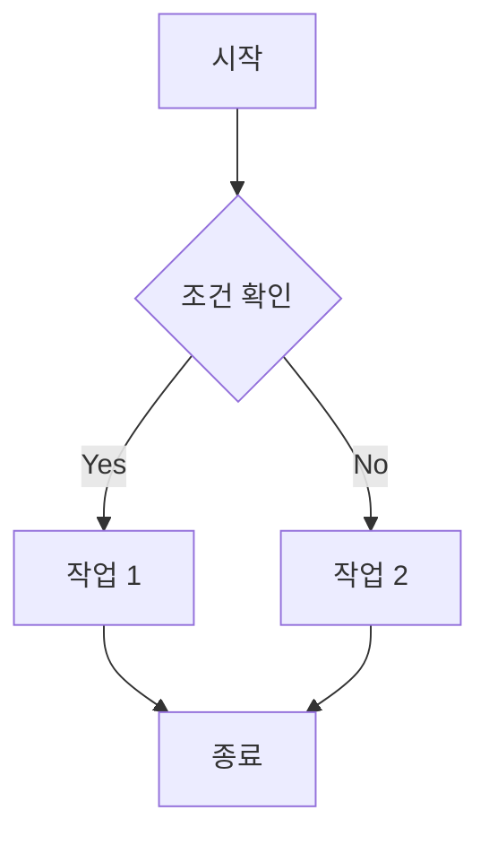

**실전 예시: 데이터 검증 파이프라인**

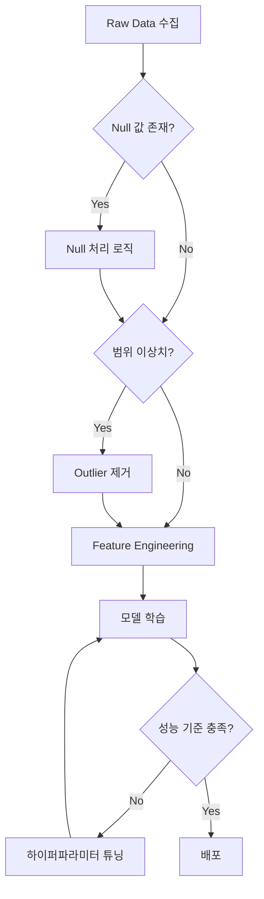

**팁**:
- `TB` (Top to Bottom), `LR` (Left to Right), `RL`, `BT` 방향 선택 가능
- 노드 모양: `[]` 사각형, `()` 둥근 모서리, `{}` 마름모(조건), `[()]` 타원
- 화살표: `-->` 실선, `-.->` 점선, `==>` 굵은 선

---

### 2. Sequence Diagram (시퀀스 다이어그램) - API/시스템 간 상호작용

**언제 사용?**
- API 호출 흐름
- 마이크로서비스 간 통신
- 사용자-시스템 상호작용

**기본 문법**

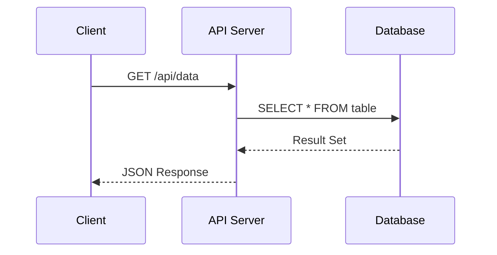

**실전 예시: 캐싱 레이어가 있는 API**

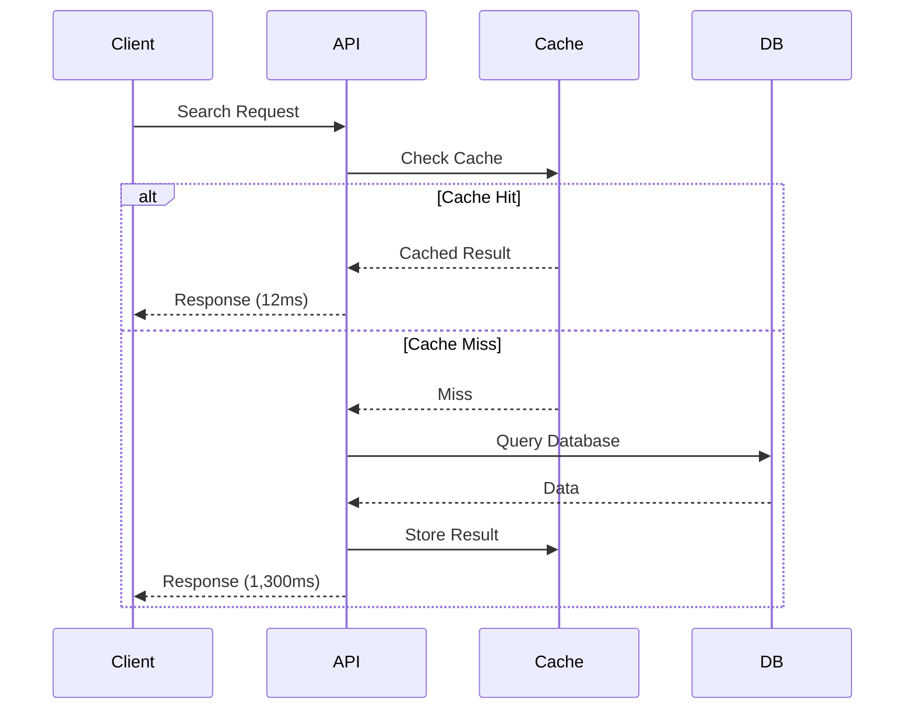

**팁**:
- `alt` / `else` / `end` 로 조건 분기
- `loop` / `end` 로 반복
- `->>` 실선 화살표, `-->>` 점선 응답
- `Note over A,B: 설명` 으로 주석

---

### 3. Graph (관계도) - 시스템 아키텍처/데이터 흐름

**언제 사용?**
- Before/After 아키텍처 비교
- 컴포넌트 간 의존성
- 데이터 소스 및 플로우

**실전 예시: Before/After 아키텍처**

**Before (Monolithic)**

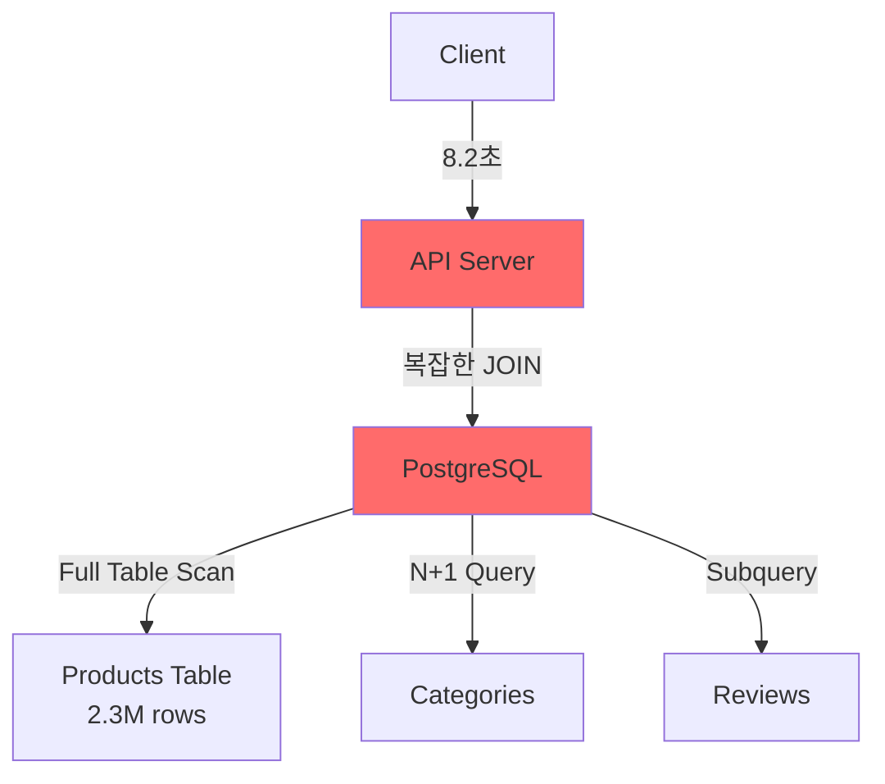

**After (Optimized)**

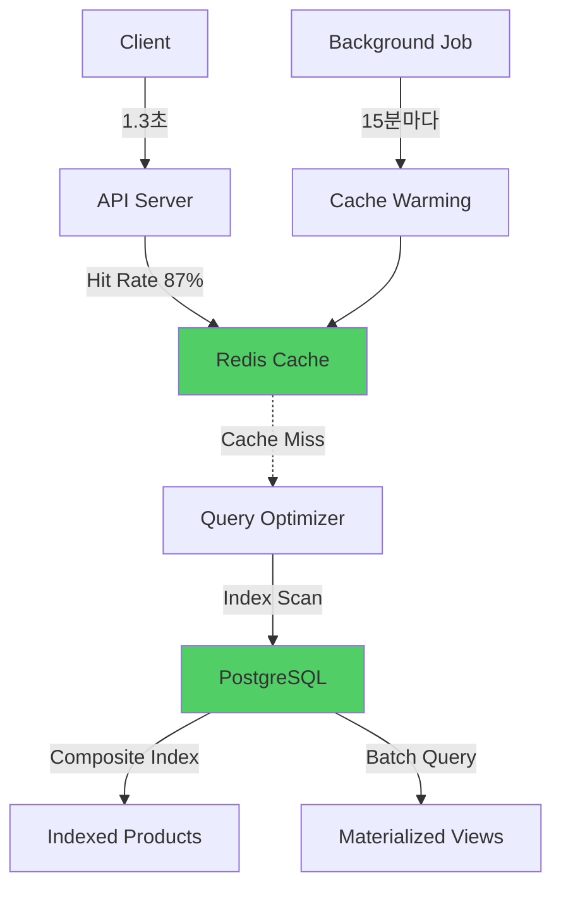

**팁**:
- `style NodeID fill:#color` 로 색상 강조 (빨강: 문제, 초록: 개선)
- `-->` 실선, `-.->` 점선으로 주/부 흐름 구분
- `<br/>` 로 노드 내 줄바꿈

---

### 4. Gantt Chart (타임라인) - 프로젝트 일정

**언제 사용?**
- 프로젝트 타임라인
- 배포 단계
- 학습 로드맵

**실전 예시: 프로젝트 타임라인**

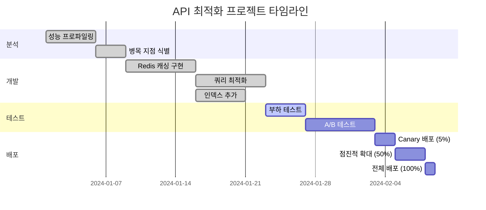

**팁**:
- `:done` 완료, `:active` 진행중, 생략하면 예정
- `after taskId` 로 의존성 표현
- `section` 으로 그룹화

---

### 5. State Diagram (상태 다이어그램) - 시스템 상태 전환

**언제 사용?**
- 주문/결제 상태 플로우
- 사용자 온보딩 단계
- 머신 러닝 파이프라인 상태

**실전 예시: 주문 상태 머신**

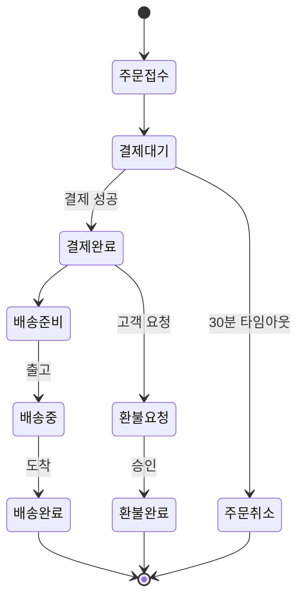

---

### 6. ER Diagram (데이터 모델) - 데이터베이스 스키마

**언제 사용?**
- 데이터베이스 설계
- 테이블 관계 설명
- Feature Engineering 소스

**실전 예시: E-commerce 데이터 모델**

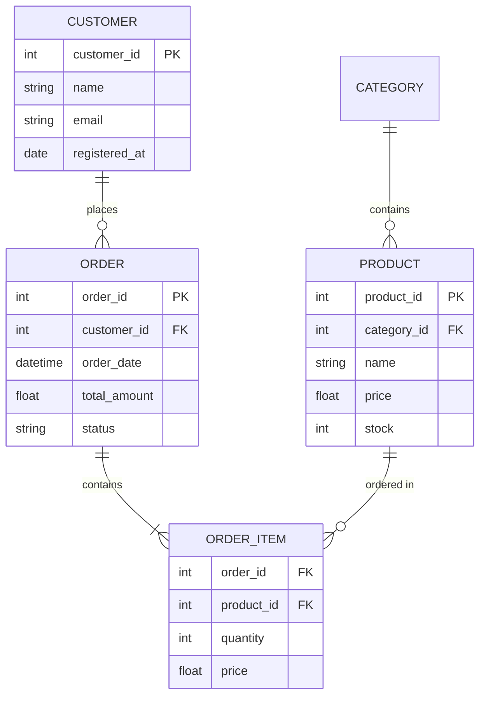

**팁**:
- `||--o{` : One to Many
- `||--||` : One to One
- `}o--o{` : Many to Many
- `PK` Primary Key, `FK` Foreign Key

---

## 📋 프로젝트 타입별 추천 다이어그램

### Type 1: Business Impact Project

**추천 1**: Graph (Before/After 아키텍처)
```
Before (문제 상황) → After (개선 후) 비교로 변화 시각화
예: "N+1 Query" vs "Batch Loading", "No Cache" vs "Redis Cache"
```

**추천 2**: Flowchart (데이터 파이프라인)
```
Raw Data → Preprocessing → Model → Prediction → API 전체 흐름
```

**추천 3**: Sequence Diagram (API 호출 흐름)
```
사용자 요청부터 응답까지의 시스템 간 상호작용
```

---

### Type 2: Exploratory/Analysis Project

**추천 1**: Flowchart (분석 프로세스)
```
데이터 수집 → EDA → 가설 설정 → 통계 검정 → 인사이트 도출
```

**추천 2**: Graph (데이터 소스 및 흐름)
```
여러 데이터 소스 (PostgreSQL, S3, API) → 통합 → 분석
```

**추천 3**: State Diagram (사용자 여정)
```
신규 가입 → 온보딩 → Active → Churned 상태 전환
```

---

### Type 3: Technical Infrastructure Project

**추천 1**: Graph (시스템 아키텍처)
```
Before/After 아키텍처 변경을 명확히 시각화
**필수**: 성능 개선 포인트 강조 (색상, 레이블)
```

**추천 2**: Sequence Diagram (최적화 전후 비교)
```
동일한 요청에 대해 Before (느림) vs After (빠름) 흐름 비교
```

**추천 3**: Flowchart (배포 파이프라인)
```
Build → Test → Deploy → Monitor 자동화 흐름
```

---

### Type 4: Learning Project

**추천 1**: Flowchart (학습 프로세스)
```
이론 학습 → 실습 → 경진대회 → 실무 적용 단계별 흐름
```

**추천 2**: Graph (모델 앙상블 구조)
```
여러 모델 (ARIMA, XGBoost, LSTM) → Stacking → 최종 예측
```

**추천 3**: Gantt Chart (학습 타임라인)
```
8주간 학습 로드맵: 이론/실습/경진대회/정리 단계
```

---

## ✅ Mermaid 다이어그램 체크리스트

프로젝트 작성 전:

- [ ] **다이어그램 1개 이상 포함**했나?
- [ ] **프로젝트 타입에 적합**한 다이어그램인가?
- [ ] **Before/After 비교** 시각화했나? (Type 1/3)
- [ ] **핵심 개선 포인트 강조**했나? (색상, 레이블, 주석)
- [ ] **노드 레이블이 명확**한가? (약어 최소화)
- [ ] **흐름이 직관적**인가? (왼쪽→오른쪽 또는 위→아래)
- [ ] **너무 복잡하지 않은가?** (노드 15개 이하 권장)

---

## 💡 Best Practices

### ✅ DO: 좋은 예시

**1. Before/After 색상으로 구분**

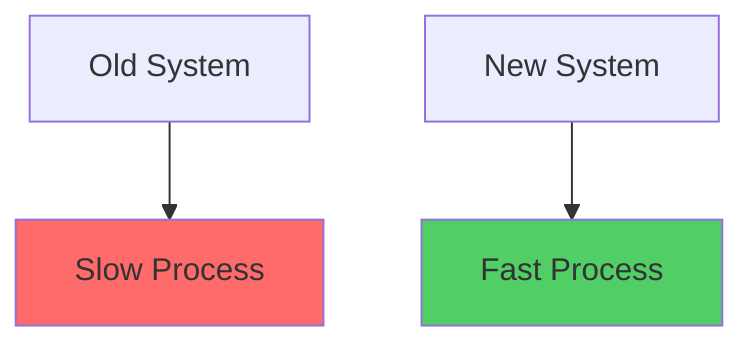

**2. 핵심 수치 노드에 포함**

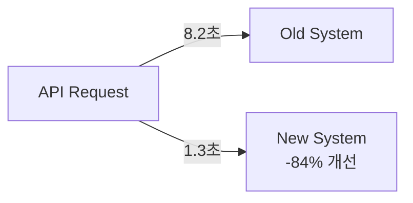

**3. 주석으로 맥락 제공**

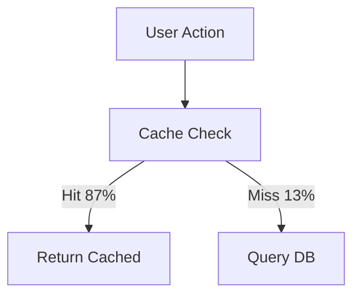

---

### ❌ DON'T: 피해야 할 예시

**1. 색상 남용**

```markdown
# ❌ 모든 노드에 다른 색상 → 의미 없는 색상은 혼란만 가중
# ✅ 문제(빨강), 개선(초록), 중립(파랑) 3가지만 사용
```

**2. 너무 복잡한 다이어그램**

```markdown
# ❌ 노드 30개, 화살표 50개 → 읽기 불가능
# ✅ 대안: 여러 개의 작은 다이어그램으로 분리
```

**3. 약어/전문 용어 과다**

```markdown
# ❌ USR → APIGW → LB → K8S (약어만 있으면 이해 불가)
# ✅ User → API Gateway → Load Balancer → Kubernetes
```

---

## 🎯 실전 팁

### Tip 1: "한 다이어그램 = 한 메시지"

각 다이어그램은 하나의 핵심 메시지만 전달해야 함

**Good**: "Redis 캐싱으로 DB 부하 87% 감소"
**Bad**: "전체 시스템 아키텍처 + 네트워크 토폴로지 + 데이터 플로우 + 보안 레이어" 모두 한 그림에

---

### Tip 2: 레이블에 성과 수치 포함

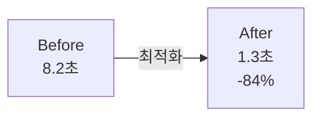

숫자가 있으면 임팩트가 명확함

---

### Tip 3: 방향 선택의 원칙

- **시간 흐름**: 왼쪽 → 오른쪽 (`LR`)
- **계층 구조**: 위 → 아래 (`TB`)
- **의사결정**: 위 → 아래 (`TB`, 조건 분기)

---

### Tip 4: 너무 복잡하면 쪼개기

15개 이상 노드 → 2-3개 다이어그램으로 분리

**예시**:
- 다이어그램 1: 전체 아키텍처 (High-level)
- 다이어그램 2: 캐싱 레이어 상세 (Detail)
- 다이어그램 3: 데이터베이스 쿼리 흐름 (Detail)

---

## 🔧 도구 및 리소스

**실시간 에디터**
- [Mermaid Live Editor](https://mermaid.live/) - 실시간 프리뷰
- VS Code Extension: "Mermaid Preview" - 로컬 편집

**공식 문서**
- [Mermaid Official Docs](https://mermaid.js.org/)
- [Flowchart Syntax](https://mermaid.js.org/syntax/flowchart.html)
- [Sequence Diagram](https://mermaid.js.org/syntax/sequenceDiagram.html)

**추천 색상 팔레트**
- 문제/느림: `#ff6b6b` (빨강)
- 개선/빠름: `#51cf66` (초록)
- 중립: `#74c0fc` (파랑)
- 강조: `#ffd43b` (노랑)

---

# Extra & Extra-Label Field Guide

> 🎯 **"프로젝트의 디테일을 살리는 섹션: Extra & Extra-Label"**
>
> 실험 설계, 기술 스펙, 데이터 상세, 가설 검증 등 프로젝트만의 독특한 정보를 구조화

---

## 📌 Extra/Extra-Label이란?

**Extra-Label**: 프로젝트 고유 섹션의 제목 (예: "A/B TEST DESIGN", "RAG SYSTEM DESIGN", "TECH SPEC")

**Extra**: 해당 섹션의 상세 내용 (마크다운 포맷, **볼드** 제목 + 설명 구조)

**포맷 규칙**:
```markdown
**제목** — 설명 내용
**제목** — 설명 내용
```

---

## 🎨 프로젝트 타입별 Extra/Extra-Label 가이드

### Type 1: Business Impact Project

#### Recommended Extra-Labels:

**1. A/B TEST DESIGN** (A/B 테스트 수행 시)

```markdown
**Control Group** — 기존 배달 시간 예측 알고리즘 (단순 거리 기반, 평균 오차 23분)
**Treatment Group** — 새로운 XGBoost 모델 (14개 feature, 평균 오차 10분)
**Sample Size** — 각 그룹 15,000건 (총 30,000건, 2주간 수집)
**Primary Metric** — MAE (Mean Absolute Error), 목표: -30% 개선
**Secondary Metrics** — CSAT 점수, 재주문율, 고객 이탈률
**Statistical Power** — 95% 신뢰수준, 80% 검정력, p<0.05
```

**2. PERFORMANCE OPTIMIZATION** (성능 개선 시)

```markdown
**Baseline Metrics** — API 평균 응답 8.2초, P95 12.4초, Timeout Rate 3.2%
**Bottleneck Analysis** — PostgreSQL Full Table Scan (67%), N+1 Query (21%), Network Latency (12%)
**Optimization Strategy** — Redis 캐싱 (L1), Composite Index (L2), Query Rewrite (L3)
**Target Metrics** — API 응답 <2초, P95 <3초, Timeout Rate <0.5%
**Implementation Order** — Phase 1: Redis (2주) → Phase 2: Index (1주) → Phase 3: Query (1주)
```

**3. DEPLOYMENT STRATEGY** (배포 전략)

```markdown
**Rollout Plan** — Canary 5% (2일) → 25% (3일) → 50% (3일) → 100% (3일)
**Rollback Criteria** — Error Rate >1%, Latency Increase >20%, Customer Complaints >5/hour
**Monitoring Dashboards** — Datadog (실시간 메트릭), Sentry (에러 추적), Mixpanel (사용자 행동)
**Success Metrics** — Zero P0 incidents, <2% rollback rate, User satisfaction >4.5/5
```

---

### Type 2: Exploratory/Analysis Project

#### Recommended Extra-Labels:

**1. HYPOTHESIS TESTING FRAMEWORK**

```markdown
**H1: 3-Day Activity Cliff** — 신규 가입 후 3일 내 미사용 시 이탈률 +340% (Null: 차이 없음)
**H2: Feature Usage Correlation** — 프로필 완성도 <50% 사용자의 30일 이탈률 78% vs >80% 사용자 32%
**H3: Re-engagement Window** — 14일 미접속 후 재방문 확률 <5% (Null: 시간 무관)
**Test Method** — Chi-square test (범주형), t-test (연속형), Logistic Regression (다변량)
**Significance Level** — α=0.05, Bonferroni correction for multiple testing
```

**2. DATA DETAILS**

```markdown
**Data Source** — PostgreSQL (user_events, subscriptions), S3 (clickstream logs), Segment (행동 데이터)
**Time Range** — 2023.01.01 ~ 2023.12.31 (12개월)
**Sample Size** — 120,847명 (신규 가입자), 이탈자 34,521명 (28.6%)
**Data Quality** — Missing values <2%, Outlier handling: IQR method, Duplicates removed (1,234건)
**Feature Engineering** — 27개 features (user demographics 8개, behavioral 12개, temporal 7개)
```

**3. STATISTICAL VALIDATION**

```markdown
**Chi-Square Test Results** — 3-Day Cliff: χ²=1,847.3, df=1, p<0.001, Cramér's V=0.124
**T-Test Results** — Profile completeness difference: t=23.4, p<0.001, Cohen's d=0.67 (medium effect)
**Logistic Regression** — AUC=0.78, Pseudo R²=0.34, Top predictors: days_to_first_activity (OR=3.2), profile_completeness (OR=2.1)
**Effect Sizes** — 3-Day Cliff: 34% → 78% churn (+44%p absolute), Profile <50%: 2.4x churn risk
```

---

### Type 3: Technical Infrastructure Project

#### Recommended Extra-Labels:

**1. TECH SPEC**

```markdown
**Stack** — Python 3.11, FastAPI, Redis 7.0, PostgreSQL 15, Docker, Kubernetes
**Architecture** — API Gateway (NGINX) → Load Balancer → FastAPI (3 replicas) → Redis Cluster (6 nodes) → PostgreSQL (primary-replica)
**Caching Strategy** — L1: In-memory LRU (10min TTL), L2: Redis (1hour TTL), L3: Database
**Indexing** — Composite index on (category_id, price, created_at), Covering index for frequent queries
**Query Optimization** — Removed 12 N+1 queries, Batch loading for relationships, Materialized views for aggregations
```

**2. BEFORE/AFTER METRICS**

```markdown
**Response Time** — Before: 8.2초 (avg), 12.4초 (P95), 18.7초 (P99) | After: 1.3초 (avg), 2.1초 (P95), 3.8초 (P99)
**Throughput** — Before: 45 req/sec | After: 287 req/sec (+538%)
**Cache Hit Rate** — N/A (no cache) → 87% (Redis)
**Database Load** — Before: 1,200 queries/min, CPU 78% | After: 156 queries/min (-87%), CPU 23%
**Cost** — Before: $1,840/month (RDS r5.2xlarge) | After: $780/month (r5.large + Redis) (-57%)
```

**3. MONITORING & ALERTS**

```markdown
**Key Metrics** — API latency (P50/P95/P99), Error rate, Cache hit ratio, DB connections, CPU/Memory
**Alert Thresholds** — P95 latency >3초 (Warning), >5초 (Critical), Error rate >1% (Warning), >3% (Critical)
**Dashboard Tools** — Grafana (real-time metrics), Prometheus (time-series), CloudWatch (AWS resources)
**On-Call Rotation** — PagerDuty integration, 15min response SLA for P1, 1hour for P2
```

---

### Type 4: Learning Project

#### Recommended Extra-Labels:

**1. LEARNING JOURNEY**

```markdown
**Week 1-2: Theory** — Time series fundamentals (ARIMA, Exponential Smoothing), Prophet framework study
**Week 3-4: Hands-on** — Kaggle tutorial kernel replication, Feature engineering experiments (lag features, rolling stats)
**Week 5-6: Competition** — Model ensemble (Prophet + XGBoost + LSTM), Hyperparameter tuning, Leaderboard climb
**Week 7: Refinement** — Error analysis, Outlier handling, Final submission (263/3,200, Bronze Medal)
**Week 8: Documentation** — GitHub repo setup, README writing, Blog post publication
```

**2. BEFORE/AFTER SKILLS**

```markdown
**Before** — Basic pandas/numpy, Linear regression only, No time series experience, No ensemble methods
**After** — Advanced feature engineering (lag/rolling/seasonal), Prophet/ARIMA/LSTM implementation, Model stacking & blending, Cross-validation for time series (TimeSeriesSplit)
**New Techniques Learned** — Walk-forward validation, Seasonal decomposition, Residual analysis, Hyperparameter tuning (Optuna)
**Confidence Level** — Time series forecasting: 3/10 → 7/10, Model ensembling: 2/10 → 8/10
```

**3. REAL-WORLD APPLICATION**

```markdown
**Problem Statement** — Company inventory forecasting: 재고 부족으로 연 매출 손실 $120K, 과재고로 보관비용 $85K
**Proposed Solution** — Kaggle에서 배운 Prophet+XGBoost 앙상블 → 재고 예측 시스템 구축
**Expected Impact** — MAPE 31% 감소 (기존 42% → 목표 29%), 재고 최적화로 연 $150K 절감
**Implementation Timeline** — Data pipeline setup (2주), Model training (1주), A/B test (2주), Full rollout (1주)
**Risk Mitigation** — Fallback to rule-based system if MAPE >35%, Manual override for seasonal events
```

**4. EXPERIMENT DESIGN** (실험적 시도가 있었던 경우)

```markdown
**Baseline Model** — Prophet (default hyperparameters), RMSE 0.342
**Experiment 1** — XGBoost with lag features → RMSE 0.298 (-12.9%)
**Experiment 2** — LSTM with sequence length 30 → RMSE 0.315 (-7.9%)
**Experiment 3** — Ensemble (Prophet 40%, XGBoost 40%, LSTM 20%) → RMSE 0.237 (-30.7%)
**Key Insight** — Ensemble captures both trend (Prophet) and non-linear patterns (XGBoost), LSTM less effective due to limited data
```

---

## 📋 Extra/Extra-Label 작성 체크리스트

작성 전 확인:

- [ ] **Extra-Label이 프로젝트에 적합한가?** (A/B Test, Tech Spec, Hypothesis 등)
- [ ] **Extra-Label은 명확한 영어 대문자 제목인가?** (예: "A/B TEST DESIGN", "TECH SPEC")
- [ ] **Extra 내용이 `**제목** — 설명` 포맷을 따르는가?**
- [ ] **정량적 수치가 포함되어 있는가?** (%, 숫자, 금액)
- [ ] **너무 길지 않은가?** (5-8개 항목 권장, 최대 10개)
- [ ] **프로젝트 본문과 중복되지 않는가?** (Extra는 추가 디테일만)
- [ ] **실제 프로젝트 수행 시 사용한 정보인가?** (억지로 만들지 않기)

---

## 💡 Best Practices

### ✅ DO: 좋은 예시

**1. 정량적 수치 포함**

```markdown
**Sample Size** — 각 그룹 15,000건 (총 30,000건, 2주간 수집)
**Baseline Metrics** — API 평균 응답 8.2초, P95 12.4초
```

**2. Before/After 비교**

```markdown
**Response Time** — Before: 8.2초 (avg) | After: 1.3초 (avg) (-84%)
**Confidence Level** — Before: 3/10 → After: 7/10
```

**3. 실험 설계 상세**

```markdown
**Control Group** — 기존 알고리즘 (단순 거리 기반)
**Treatment Group** — XGBoost 모델 (14개 feature)
**Primary Metric** — MAE, 목표: -30% 개선
```

---

### ❌ DON'T: 피해야 할 예시

**1. 추상적/모호한 내용**

```markdown
❌ **Strategy** — 좋은 전략을 사용했습니다
✅ **Strategy** — Canary 5% (2일) → 50% (3일) → 100% (3일)
```

**2. 정량 수치 없음**

```markdown
❌ **Performance** — 많이 개선되었습니다
✅ **Performance** — Response time 8.2초 → 1.3초 (-84%)
```

**3. 본문과 중복**

```markdown
❌ Extra에 이미 본문에 있는 내용 반복
✅ Extra에는 본문에 없는 추가 디테일 (하이퍼파라미터, 실험 조건 등)
```

**4. 과도한 기술 용어/약어**

```markdown
❌ **Tech** — K8S, CICD, IaC, SRE, MTTR, MTTD
✅ **Tech** — Kubernetes deployment, CI/CD with GitHub Actions, Infrastructure as Code (Terraform)
```

---

## 🎯 프로젝트 타입별 추천 Extra-Label

### Type 1: Business Impact
1. **A/B TEST DESIGN** - A/B 테스트 수행 시 필수
2. **PERFORMANCE OPTIMIZATION** - 성능 개선 프로젝트
3. **DEPLOYMENT STRATEGY** - 배포 전략이 복잡한 경우
4. **COST ANALYSIS** - 비용 절감이 주요 성과일 때

### Type 2: Exploratory/Analysis
1. **HYPOTHESIS TESTING FRAMEWORK** - 가설 검증 프로젝트
2. **DATA DETAILS** - 데이터 규모/품질이 중요할 때
3. **STATISTICAL VALIDATION** - 통계적 검증 강조
4. **SEGMENTATION ANALYSIS** - 세그먼트별 분석 수행 시

### Type 3: Technical Infrastructure
1. **TECH SPEC** - 기술 스택/아키텍처 상세
2. **BEFORE/AFTER METRICS** - 성능 개선 지표 비교
3. **MONITORING & ALERTS** - 모니터링/알림 시스템
4. **SCALABILITY DESIGN** - 확장성 고려사항

### Type 4: Learning Project
1. **LEARNING JOURNEY** - 학습 과정 타임라인
2. **BEFORE/AFTER SKILLS** - 역량 변화
3. **REAL-WORLD APPLICATION** - 실무 적용 계획
4. **EXPERIMENT DESIGN** - 실험적 시도

---

## 📝 실전 예시: Complete Extra/Extra-Label

### Example 1: 배달 시간 예측 (Type 1)

**Extra-Label**: `A/B TEST DESIGN`

**Extra**:
```markdown
**Control Group** — 기존 배달 시간 예측 알고리즘 (단순 거리 기반, 평균 오차 23분)
**Treatment Group** — 새로운 XGBoost 모델 (14개 feature: 거리, 시간대, 날씨, 교통, 주문량 등, 평균 오차 10분)
**Sample Size** — 각 그룹 15,000건 (총 30,000건, 서울/경기 지역, 2주간 수집)
**Randomization** — User ID 기반 50:50 split, 동일 사용자는 동일 그룹 유지
**Primary Metric** — MAE (Mean Absolute Error), 목표: 기존 23분 → 15분 이하 (-35%)
**Secondary Metrics** — CSAT 점수 (목표: +10점), 재주문율 (목표: +5%p), 고객 이탈률 (목표: -3%p)
**Statistical Power** — 95% 신뢰수준, 80% 검정력, p<0.05, 최소 탐지 효과크기: 5분
**Duration** — 2주 (Week 1: 데이터 수집, Week 2: 분석 및 의사결정)
```

---

### Example 2: 이탈 분석 (Type 2)

**Extra-Label**: `DATA DETAILS`

**Extra**:
```markdown
**Data Sources** — PostgreSQL (user_events 테이블, subscriptions 테이블), Amazon S3 (clickstream logs), Segment (행동 데이터)
**Time Range** — 2023.01.01 ~ 2023.12.31 (12개월, 완전한 연간 사이클 포함)
**Sample Size** — 총 120,847명 (신규 가입자), 이탈자 34,521명 (28.6% 이탈률), 활성 사용자 86,326명
**Data Quality Checks** — Missing values <2% (median imputation), Outlier handling: IQR method (3,247건 제거), Duplicates removed (1,234건)
**Feature Categories** — User demographics (8 features: age, gender, location, signup_source, device_type 등), Behavioral metrics (12 features: session_count, avg_session_duration, feature_usage_count 등), Temporal features (7 features: days_since_signup, days_to_first_activity, weekend_activity_ratio 등)
**Validation Split** — Train 70% (84,593명), Validation 15% (18,127명), Test 15% (18,127명), Time-based split to prevent data leakage
**Class Imbalance** — Churn class: 28.6%, Non-churn: 71.4%, Handling: SMOTE oversampling + class weights
```

---

### Example 3: API 최적화 (Type 3)

**Extra-Label**: `TECH SPEC`

**Extra**:
```markdown
**Stack** — Python 3.11, FastAPI 0.104, Redis 7.0, PostgreSQL 15.2, Docker 24, Kubernetes 1.28
**Architecture** — NGINX (API Gateway) → AWS ALB (Load Balancer) → FastAPI (3 replicas, 2 vCPU, 4GB RAM each) → Redis Cluster (6 nodes: 3 primary, 3 replica) → PostgreSQL (r5.large primary + r5.large read replica)
**Caching Strategy** — L1: In-memory LRU cache (10min TTL, 최대 1,000개 항목), L2: Redis (1hour TTL, LRU eviction), L3: PostgreSQL database
**Indexing** — Composite index on (category_id, price, created_at) for product listing queries, Covering index on (user_id, created_at) INCLUDE (status, amount) for user orders, Partial index on (status) WHERE status IN ('pending', 'processing') for admin dashboard
**Query Optimization** — Removed 12 N+1 queries (replaced with select_related/prefetch_related), Batch loading for product-category relationships, Materialized view for daily sales aggregations (refreshed every 1 hour)
**Deployment** — Blue-green deployment using Kubernetes, Health checks: /health (liveness), /ready (readiness), Auto-scaling: 3-10 pods based on CPU >70%
```

---

### Example 4: Kaggle 학습 (Type 4)

**Extra-Label**: `LEARNING JOURNEY`

**Extra**:
```markdown
**Week 1-2: Theory Foundation** — Time series fundamentals (ARIMA, Exponential Smoothing, Seasonality decomposition), Prophet framework study (Facebook's paper + tutorials), Kaggle tutorials (5 kernel replications)
**Week 3-4: Hands-on Practice** — Feature engineering experiments (lag features 1-7 days, rolling statistics 7/14/30 days, day of week encoding), Baseline Prophet model (RMSE: 0.342), XGBoost with lag features (RMSE: 0.298)
**Week 5-6: Competition Participation** — Model ensemble design (Prophet 40%, XGBoost 40%, LSTM 20%), Hyperparameter tuning (Optuna: 200 trials), Leaderboard climb (Started: 1,800/3,200 → Final: 263/3,200)
**Week 7: Refinement & Submission** — Error analysis (identified outliers in holiday periods), Outlier handling strategy (separate model for holidays), Final submission (RMSE: 0.237, -30.7% from baseline), Bronze Medal achievement
**Week 8: Documentation & Sharing** — GitHub repository setup (code + README), Kaggle discussion post (15 upvotes), Medium blog post (127 views), LinkedIn update (23 reactions)
**Total Time Investment** — 87 hours (12 hours/week avg), 47 Kaggle kernels reviewed, 8 research papers read
```

---

## Version History

- **v1.3.0** (2026.02.11): Differentiation, quantification, Type 4, examples, Mermaid, & Extra guide
  - Comprehensive guide for avoiding "template-y" appearance
  - Business impact quantification formulas and templates
  - ROI calculation examples (5 categories: time, efficiency, conversion, cost, error)
  - Impact table templates (3 formats)
  - **Type 4 complete redesign** - Goal & Context, Learning Journey, Before/After, Real-world Application, Community Impact
  - Type 4 now matches Type 1/2/3 quality standards
  - **4 gold standard example projects** (Type 1/2/3/4) demonstrating all features
  - **Mermaid Diagram Guide** - 6 diagram types, project-specific recommendations, best practices
  - Flowchart, Sequence, Graph, Gantt, State, ER diagram examples
  - Before/After architecture visualization techniques
  - Diagram checklist + practical tips
  - **Extra & Extra-Label Field Guide** - Comprehensive guide with 4 complete examples
  - Project-type-specific Extra-Label recommendations
  - 15+ Extra-Label templates (A/B Test, Tech Spec, Hypothesis Testing, Learning Journey, etc.)
  - `**제목** — 설명` format with best practices
  - DO/DON'T examples with quantitative criteria
  - Project-specific emphasis strategies (performance/efficiency/insight)
  - Section order flexibility guidelines
  - Writing style variety (formal/casual/technical)
  - Visual differentiation techniques
  - 6-point differentiation checklist + 7-point quantification checklist + 7-point diagram checklist + 7-point Extra checklist
- **v1.2.0** (2026.02.11): Major improvements based on recruiter & expert feedback
  - Added Collaboration & Impact section (Type 1/2/3)
  - Added Statistical Validation section (Type 2)
  - Added Deployment & Usage section (Type 1/3)
  - Removed duplicate "데이터 특성" table in Type 2
  - Moved Key Takeaways earlier in Type 1
  - Increased code block limit: 10 lines → 15-20 lines
  - Enhanced hypothesis testing guidance
  - Added business context to all types
- **v1.1.0** (2026.02.11): Added Dataset section to Type 1/2/3 templates
- **v1.0.0** (2026.02.10): Initial release
